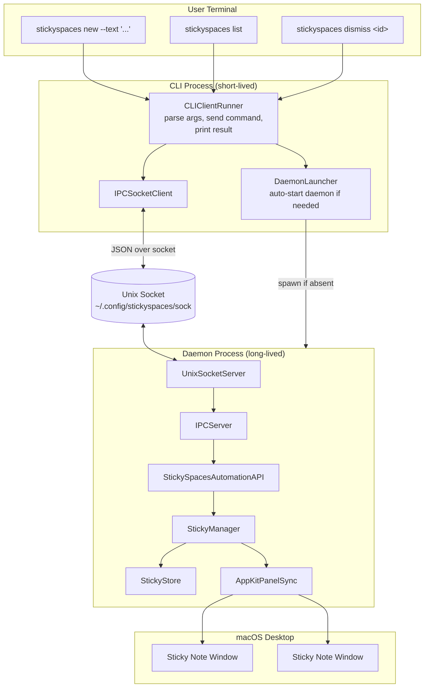
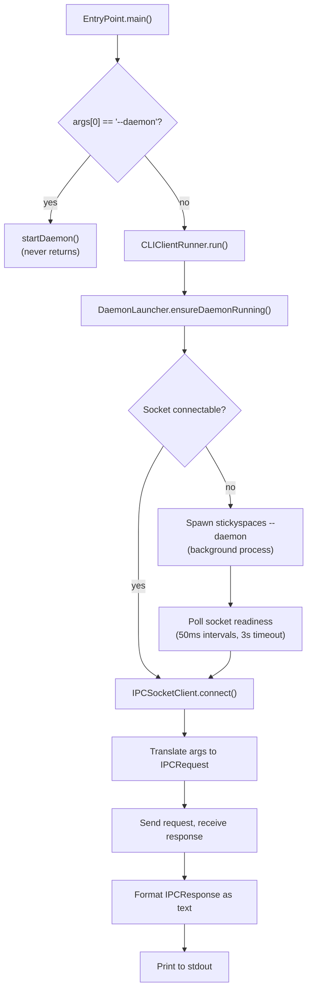

# Technical Specification: CLI Interface (Client-Server IPC)

**Version**: 1.0
**Date**: 2026-03-04
**Quality Score**: 92/100
**PRD Reference**: [StickySpaces PRD](stickyspaces-prd.md)
**Parent Spec**: [StickySpaces Tech Spec](stickyspaces-tech-spec.md)

---

## Overview

The stickyspaces CLI is the primary control surface for all user interactions — triggered by Keyboard Maestro hotkeys, terminal commands, and E2E tests. Today the CLI creates a fresh in-memory `DemoApp` with fakes on every invocation: it prints text output like `created id: <UUID> workspace: 1` but no windows appear and state is lost immediately.

This spec defines the client-server IPC layer that makes the CLI functional: a long-lived daemon process that owns the `StickyStore` and creates real `NSPanel` windows, and a short-lived CLI client that talks to the daemon over a Unix socket. The daemon starts lazily on first use — the user never manages it directly.

### Scope Boundary

This spec covers the CLI transport layer only: how commands get from the terminal to the daemon and back. It does not cover the command semantics (what `new`, `edit`, `zoom-out` etc. do) — those are defined in the [parent spec](stickyspaces-tech-spec.md) and already implemented in `IPCServer`, `StickySpacesAutomationAPI`, and `StickyManager`. It also does not cover a real `YabaiAdapter` — the daemon uses `FakeYabaiQuerying` hardcoded to workspace 1 until a separate yabai integration effort.

---

## Requirements

### Functional Requirements

- **FR-1**: A user should be able to run any stickyspaces command (e.g., `stickyspaces new --text "Project kickoff notes"`) and have it take effect in a persistent daemon — because today every invocation is ephemeral, making the CLI useless for actual work.

- **FR-2**: The daemon should start automatically on first CLI invocation, with no separate setup step — because requiring `stickyspaces serve` before `stickyspaces new` doubles the friction of a quick capture and breaks the Keyboard Maestro hotkey-to-action promise.

- **FR-3**: Subsequent CLI invocations should reuse the already-running daemon — because creating a new in-memory universe per command means `list` can never show what `new` created.

- **FR-4**: The daemon should create real macOS floating windows (`NSPanel`) when stickies are created — because the product promise is visible sticky notes on the desktop, not text printed to a terminal.

- **FR-5**: The CLI should print a clear, actionable error when the daemon cannot be started — because a silent failure after a hotkey press leaves the user confused about whether anything happened.

- **FR-6**: The daemon should stay alive across CLI invocations until explicitly killed or the system shuts down — because stickies and their windows must persist for the duration of the work session (constraint C-3 in the parent spec).

### Non-Functional Requirements

- **NFR-1**: CLI command round-trip (client connect + send + receive + print) should complete in under 200ms p95 — because the Keyboard Maestro hotkey path adds ~50ms overhead, and the parent spec requires <100ms hotkey-to-visible-panel (NFR-1 in parent), leaving ~50ms budget for socket overhead.

- **NFR-2**: Daemon startup (spawn + bind socket + ready for connections) should complete in under 3 seconds — because this is the one-time cost on first use, and anything longer than a few seconds feels broken after pressing a hotkey.

- **NFR-3**: Adding a new CLI command should require changes in at most two files (arg-to-`IPCRequest` translation + response formatting) — because the parent spec (NFR-4) promises new commands in under 1 hour, and the transport layer must not add friction to that.

- **NFR-4**: The existing in-process test path (`StickySpacesCLICommandRunner.run(args:app:)`) must remain unchanged — because 10 CLI integration tests and 7 IPC integration tests depend on it, and breaking them would be a regression with no product value.

### Constraints

- **C-1**: The IPC transport must use a Unix domain socket at `~/.config/stickyspaces/sock` — because the parent spec (D-1) already defines this path, and `IPCServer`, `IPCWireCodec`, `IPCRequest`/`IPCResponse` are all built around newline-delimited JSON over this socket.

- **C-2**: At most one daemon process may own the socket and store at any time — because split-brain control planes make stickies appear lost or uncontrollable (parent spec C-9).

- **C-3**: The daemon must clean up the socket file and lock on termination (including SIGINT/SIGTERM) — because stale socket files prevent the next daemon from starting, requiring manual cleanup the user won't know how to do.

- **C-4**: The `--daemon` flag is an internal mechanism, not a user-facing command — because exposing process management to users adds cognitive load that contradicts the "zero-friction capture" design goal.

---

## Architecture

### System Context



### CLI Entry Point Routing

Every CLI invocation enters `EntryPoint.main()`. If `--daemon` is the first argument, the process enters daemon mode and never returns. Otherwise, it enters client mode: ensure the daemon is running, connect, send the command, print the result, and exit.



### Component Design

#### UnixSocketServer (new: `Sources/StickySpacesApp/UnixSocketServer.swift`)

An actor that bridges the POSIX socket layer to the existing `IPCServer`:

- `init(socketPath: String, ipcServer: IPCServer)` — binds a Unix domain socket using POSIX `socket(AF_UNIX, SOCK_STREAM, 0)`, `bind()`, `listen()`
- `start()` — runs an accept loop via `withTaskGroup`, spawning a child task per connection that reads newline-delimited lines, calls `ipcServer.handleLine(_:)`, and writes the response back
- `shutdown()` — cancels the task group, closes the file descriptor, unlinks the socket path

The server is a thin transport adapter. All command routing, validation, and error handling already lives in [`IPCServer.handleLine(_:)`](Sources/StickySpacesApp/IPCServer.swift) — the socket server just moves bytes.

#### IPCSocketClient (new: `Sources/StickySpacesCLI/IPCSocketClient.swift`)

A struct that connects to the daemon and sends individual requests:

- `init(socketPath: String) throws` — opens a Unix socket connection. Throws `IPCSocketClientError.connectionFailed` if the socket file is absent or connection is refused.
- `func send(_ request: IPCRequest) async throws -> IPCResponse` — encodes via `IPCWireCodec.encodeRequestLine()`, writes to socket, reads response line, decodes via `IPCWireCodec.decodeResponseLine()`.

The first call after connect sends a `.hello(protocolVersion: 1)` handshake. If the server responds with `.protocolMismatch(...)`, the client throws with an actionable upgrade message.

#### DaemonLauncher (new: `Sources/StickySpacesCLI/DaemonLauncher.swift`)

Ensures a daemon is running before client operations:

- `static func ensureDaemonRunning(socketPath: String) async throws` — the core entry point:
  1. Attempt a probe connection to the socket. If it succeeds, return immediately (daemon already running).
  2. If the socket file exists but connection fails, check the instance lock. If the lock is not held, unlink the stale socket.
  3. Resolve the current executable path via `ProcessInfo.processInfo.arguments[0]`.
  4. Spawn `stickyspaces --daemon` as a detached background `Process` with stdout/stderr redirected to `~/.config/stickyspaces/daemon.log`.
  5. Poll the socket at 50ms intervals (up to 3 seconds) until a probe connection succeeds.
  6. If the timeout expires, throw `DaemonLaunchError.timeout` with a message pointing to the daemon log.

#### Daemon Mode (modify: `Sources/StickySpacesCLI/EntryPoint.swift`)

When `stickyspaces --daemon` is invoked:

1. Create `~/.config/stickyspaces/` directory.
2. Acquire an exclusive file lock on `~/.config/stickyspaces/instance.lock` via POSIX `flock()`. If the lock is already held, print `"StickySpaces daemon is already running."` to stderr and exit 1.
3. Wire real dependencies: `StickyStore()`, `AppKitPanelSync()`, `StickyManager(store:yabai:panelSync:)` with `FakeYabaiQuerying(currentSpace: WorkspaceID(rawValue: 1))`.
4. Create `IPCServer(manager:)` and `UnixSocketServer(socketPath:ipcServer:)`.
5. Install signal handlers for SIGINT/SIGTERM that call `unlink()` on the socket and lock paths, then `exit(0)`.
6. Call `server.start()` and then `NSApplication.shared.run()` to keep the process alive and pump AppKit events for panel rendering.

#### CLIClientRunner (new: `Sources/StickySpacesCLI/CLIClientRunner.swift`)

Translates CLI arguments into IPC round-trips:

- `static func run(args: [String], socketPath: String) async throws -> String` — the entry point for all user-facing commands:
  1. Call `DaemonLauncher.ensureDaemonRunning(socketPath:)`.
  2. Create `IPCSocketClient(socketPath:)`.
  3. Translate `args` to an `IPCRequest` using extracted arg-parsing helpers (same `parseOption`, `parseDoubleOption`, `parseIntOption` logic currently in `StickySpacesCLICommandRunner`).
  4. Call `client.send(request)`.
  5. Format the `IPCResponse` as a human-readable string and return it.

The arg-to-request translation and response formatting are the only CLI-specific logic. The transport, routing, and command execution are all reused from existing code.

### Key Architectural Decisions

**D-1: Lazy daemon start rather than explicit `serve` command.** The CLI tries to connect on every invocation; if the daemon is absent, it spawns one automatically. This eliminates a manual setup step and preserves the Keyboard Maestro hotkey contract (press hotkey → sticky appears, no prerequisites). _(Satisfies FR-2.)_

**D-2: The daemon is a background instance of the same `stickyspaces` binary.** Reusing the same executable (with a `--daemon` flag) avoids a separate daemon binary, simplifies the build, and means `DaemonLauncher` can resolve the executable path from `ProcessInfo`. _(Satisfies FR-2, NFR-3.)_

**D-3: `UnixSocketServer` is a thin transport adapter over the existing `IPCServer`.** All command routing is already implemented in `IPCServer.handleLine()`. The socket server only handles `accept()`/`read()`/`write()` and delegates every line to `IPCServer`. This means adding a new command requires zero changes to the transport layer. _(Satisfies NFR-3.)_

**D-4: File-based instance lock (`flock`) prevents double-daemon.** POSIX `flock()` is automatically released on process exit (including crashes and SIGKILL), so a stale lock file cannot permanently block daemon startup. Combined with stale-socket cleanup in `DaemonLauncher`, this handles all daemon lifecycle edge cases. _(Satisfies C-2, C-3.)_

**D-5: Preserve the in-process `DemoApp` test path.** `StickySpacesCLICommandRunner.run(args:app:)` stays unchanged. The new `CLIClientRunner` is a parallel path for real usage. Tests that exercise command semantics continue to use the fast in-process path; only transport-level tests use actual sockets. _(Satisfies NFR-4.)_

### File Changes

```
Sources/StickySpacesApp/
  UnixSocketServer.swift              [NEW]  — socket accept loop, delegates to IPCServer

Sources/StickySpacesCLI/
  EntryPoint.swift                    [MODIFY] — route --daemon to daemon mode, else client mode
  StickySpacesCLI.swift               [KEEP]   — unchanged, used by integration tests
  IPCSocketClient.swift               [NEW]  — connect, handshake, send/receive
  DaemonLauncher.swift                [NEW]  — lazy daemon spawn + readiness polling
  CLIClientRunner.swift               [NEW]  — args-to-IPCRequest, send, format response

Tests/Integration/
  IPCSocketRoundTripTests.swift       [NEW]  — socket-level client-server tests
  CLIClientModeTests.swift            [NEW]  — end-to-end CLI client mode tests
```

### Interfaces

**`UnixSocketServer`** (public interface):

```swift
public actor UnixSocketServer {
    public init(socketPath: String, ipcServer: IPCServer)
    public func start() async throws
    public func shutdown() async
}
```

**`IPCSocketClient`** (public interface):

```swift
public struct IPCSocketClient: Sendable {
    public init(socketPath: String) throws
    public func send(_ request: IPCRequest) async throws -> IPCResponse
}
```

**`DaemonLauncher`** (public interface):

```swift
public enum DaemonLauncher {
    public static func ensureDaemonRunning(socketPath: String) async throws
}
```

**`CLIClientRunner`** (public interface):

```swift
public enum CLIClientRunner {
    public static func run(args: [String], socketPath: String) async throws -> String
}
```

### Risks & Assumptions

| Risk | Impact | Mitigation |
| --- | --- | --- |
| `NSApplication.shared.run()` from a CLI binary may not initialize AppKit properly (no bundle, no Info.plist) | Panels fail to render or appear | `AppKitPanelSync` already calls `setActivationPolicy(.regular)` + `activate(ignoringOtherApps:)`; validate in first integration test. If needed, switch to `.accessory` to avoid Dock icon. |
| Daemon spawn latency exceeds 3s on cold Swift runtime | First command times out | 3s is conservative for a warm system. Log timeout to daemon.log and surface the log path in the error message. |
| Stale socket file from a crashed daemon blocks next launch | CLI hangs or errors on next use | `DaemonLauncher` checks `flock()` on instance lock before trusting socket. Stale socket without lock → unlink and respawn. |
| Signal handler cleanup races with `NSApplication` teardown | Socket file orphaned on certain kill sequences | POSIX `unlink()` is async-signal-safe. Signal handler calls unlink before exit, regardless of AppKit state. |
| Background process inherits terminal environment variables | Daemon picks up `STICKYSPACES_SIMULATE_YABAI_UNAVAILABLE` or other test env vars | `DaemonLauncher` explicitly clears test-only env vars when spawning the daemon process. |

---

## Test Specification

### Testing Strategy

Tests are organized in two layers: **socket-level** tests validate the transport (server + client + wire codec), and **CLI client mode** tests validate the full end-to-end path (arg parsing → daemon communication → formatted output). Both layers use real Unix sockets on temp paths for isolation.

The existing in-process test suites ([`CLIWorkflowTests`](Tests/Integration/CLIWorkflowTests.swift), [`IPCWorkflowTests`](Tests/Integration/IPCWorkflowTests.swift)) are unmodified — they continue to cover command semantics via the `DemoApp` path.

### Requirement Coverage

| Requirement | Test |
| --- | --- |
| FR-1 (commands take effect in persistent daemon) | `clientCreatesStickyViaSocketAndReceivesCreatedResponse` |
| FR-2 (daemon starts automatically) | `daemonLauncherSpawnsBackgroundProcessWhenSocketAbsent` |
| FR-3 (subsequent invocations reuse daemon) | `statePersistsAcrossSeparateClientConnections` |
| FR-4 (real windows created) | Manual validation (AppKit panels require a window server) |
| FR-5 (actionable error on failure) | `cliPrintsDaemonNotRunningWhenLaunchFails` |
| FR-6 (daemon stays alive) | `statePersistsAcrossSeparateClientConnections` |
| NFR-1 (round-trip < 200ms) | `socketRoundTripLatencyUnder200ms` |
| NFR-4 (in-process tests unchanged) | Existing `CLIWorkflowTests` pass without modification |
| C-1 (Unix socket at well-known path) | `serverBindsAndAcceptsOnSpecifiedPath` |
| C-2 (single daemon instance) | `secondDaemonExitsWhenLockHeld` |
| C-3 (cleanup on termination) | `serverShutdownRemovesSocketFile` |

### Socket-Level Tests (`Tests/Integration/IPCSocketRoundTripTests.swift`)

```swift
import Foundation
import Testing
@testable import StickySpacesApp
@testable import StickySpacesCLI
@testable import StickySpacesShared

@Suite("Client connects to daemon via Unix socket and manages stickies")
struct IPCSocketRoundTripTests {
    @Test("client creates a sticky via socket and receives created response with workspace ID")
    func clientCreatesStickyViaSocketAndReceivesCreatedResponse() async throws {
        let env = try await TestServerEnvironment()
        defer { Task { await env.shutdown() } }

        let client = try IPCSocketClient(socketPath: env.socketPath)
        let response = try await client.send(.new(text: "Project kickoff notes"))

        guard case .created(_, let workspaceID) = response else {
            Issue.record("expected .created, got \(response)")
            return
        }
        #expect(workspaceID == WorkspaceID(rawValue: 1))
    }

    @Test("state persists across separate client connections to the same server") ...
    @Test("server shutdown removes the socket file from disk") ...
    @Test("socket round-trip completes in under 200ms at p95") ...
}
```

### CLI Client Mode Tests (`Tests/Integration/CLIClientModeTests.swift`)

```swift
@Suite("CLI commands route through socket to a running daemon")
struct CLIClientModeTests {
    @Test("user creates and lists stickies through the client runner")
    func userCreatesAndListsStickiesThroughClientRunner() async throws {
        let env = try await TestServerEnvironment()
        defer { Task { await env.shutdown() } }

        let newOutput = try await CLIClientRunner.run(
            args: ["new", "--text", "Sprint planning"], socketPath: env.socketPath
        )
        #expect(newOutput.contains("created"))

        let listOutput = try await CLIClientRunner.run(
            args: ["list"], socketPath: env.socketPath
        )
        #expect(listOutput.contains("Sprint planning"))
    }

    @Test("daemon launcher reuses existing daemon when socket is connectable") ...
    @Test("CLI prints actionable error when daemon launch fails") ...
    @Test("unknown command returns usage help via socket round-trip") ...
}
```

### Test Helper: `TestServerEnvironment`

A reusable helper that starts a real `UnixSocketServer` + `IPCServer` on a unique temp socket path, wired to an in-memory `StickyStore` with `FakeYabaiQuerying`. Each test gets an isolated server instance.

```swift
struct TestServerEnvironment {
    let socketPath: String
    let server: UnixSocketServer

    init() async throws {
        let dir = FileManager.default.temporaryDirectory
        socketPath = dir.appendingPathComponent("test-\(UUID().uuidString).sock").path

        let store = StickyStore()
        let yabai = FakeYabaiQuerying(currentSpace: WorkspaceID(rawValue: 1))
        let panelSync = InMemoryPanelSync()
        let manager = StickyManager(store: store, yabai: yabai, panelSync: panelSync)
        let ipcServer = IPCServer(manager: manager)
        server = UnixSocketServer(socketPath: socketPath, ipcServer: ipcServer)
        try await server.start()
    }

    func shutdown() async {
        await server.shutdown()
    }
}
```

---

## Delivery Plan

### Phase 1: Socket Server + Client (riskiest assumption first)

The riskiest assumption is that a Swift actor can reliably accept Unix socket connections, delegate to `IPCServer`, and respond — all within the existing concurrency model. Validate this end-to-end before building the daemon launcher or CLI routing.

**Tasks:**
- [ ] `UnixSocketServer` actor: POSIX bind/listen/accept, delegate to `IPCServer.handleLine()`, write response
- [ ] `IPCSocketClient` struct: connect, `hello` handshake, `send()` with `IPCWireCodec`
- [ ] `TestServerEnvironment` helper with unique temp socket per test
- [ ] `IPCSocketRoundTripTests`: create via socket, state persistence across connections, shutdown cleanup, latency gate

**Acceptance:**
- [ ] `clientCreatesStickyViaSocketAndReceivesCreatedResponse` passes
- [ ] `statePersistsAcrossSeparateClientConnections` passes
- [ ] `serverShutdownRemovesSocketFile` passes
- [ ] Existing `CLIWorkflowTests` and `IPCWorkflowTests` still pass (no regressions)

### Phase 2: Daemon Mode + Instance Lock

With socket transport proven, build the daemon process that hosts it.

**Tasks:**
- [ ] `--daemon` flag handling in `EntryPoint.swift`: create directory, acquire `flock`, wire real deps, start `UnixSocketServer`, run `NSApplication`
- [ ] SIGINT/SIGTERM signal handlers for socket + lock cleanup
- [ ] File-based instance lock with stale-lock detection
- [ ] Test: second daemon attempt exits cleanly when lock is held

**Acceptance:**
- [ ] `stickyspaces --daemon` starts, binds socket, and responds to a manual `IPCSocketClient` connection in a test
- [ ] Killing the daemon with SIGTERM removes the socket file
- [ ] A second `stickyspaces --daemon` prints "already running" and exits 1

### Phase 3: Daemon Launcher + CLI Client Runner

With the daemon proven, build the lazy-start glue and the client-side arg translation.

**Tasks:**
- [ ] `DaemonLauncher.ensureDaemonRunning()`: probe, stale cleanup, spawn, poll
- [ ] `CLIClientRunner.run(args:socketPath:)`: ensure daemon, translate args to `IPCRequest`, send, format `IPCResponse`
- [ ] Extract arg-parsing helpers from `StickySpacesCLICommandRunner` into shared utility (or duplicate — they are simple)
- [ ] Modify `EntryPoint.main()`: `--daemon` → daemon mode, everything else → `CLIClientRunner`
- [ ] `CLIClientModeTests`: create+list, daemon reuse, error formatting

**Acceptance:**
- [ ] `userCreatesAndListsStickiesThroughClientRunner` passes (against pre-started test server)
- [ ] Running `swift run stickyspaces new --text "Hello"` from a terminal with no daemon → daemon starts, sticky created, output printed
- [ ] Running `swift run stickyspaces list` after → shows the sticky from the previous command
- [ ] All existing test suites remain green

### Phase 4: Polish + Hardening

**Tasks:**
- [ ] Daemon log rotation / size cap for `~/.config/stickyspaces/daemon.log`
- [ ] Clear test-only env vars when spawning daemon from `DaemonLauncher`
- [ ] `stickyspaces stop` command to cleanly terminate the daemon (optional, low priority)
- [ ] Verify `AppKitPanelSync` creates visible panels when daemon is started from CLI binary (manual validation on macOS desktop)

**Acceptance:**
- [ ] End-to-end manual test: `stickyspaces new --text "Hello"` creates a visible floating window on the desktop
- [ ] `stickyspaces dismiss-all` removes all windows

---

## Open Questions

- **AppKit from CLI binary**: Will `NSApplication.shared.run()` in a CLI executable (no `.app` bundle) reliably create and display `NSPanel` windows? `AppKitPanelSync` already calls `setActivationPolicy(.regular)`, which should work. Validated in Phase 2.
- **Daemon lifecycle UX**: Should there be a `stickyspaces stop` command? Or is killing the daemon via `pkill` / system shutdown sufficient for MVP? Deferred to Phase 4 as optional.
- **Daemon log location**: `~/.config/stickyspaces/daemon.log` is the default. Should this be configurable? Not for MVP.
