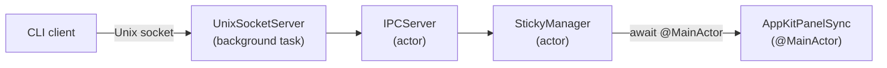
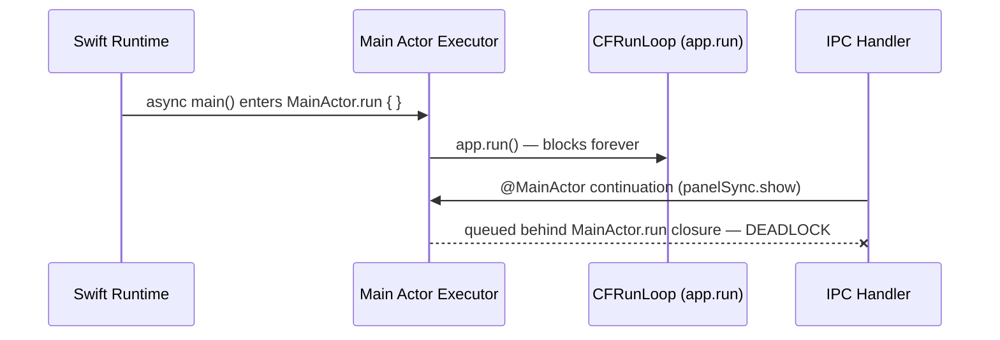
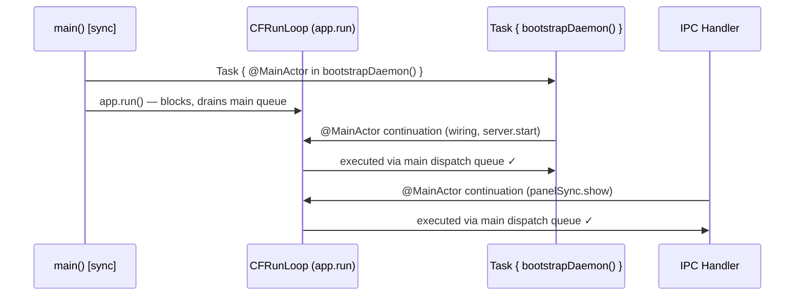

# Technical Specification: Daemon Event Loop Fix

**Version**: 1.0
**Date**: 2026-03-04
**Quality Score**: 91/100
**PRD Reference**: [CLI Interface Tech Spec](cli-interface-tech-spec.md) — FR-4 (real NSPanel windows), NFR-1 (<200ms round-trip)

---

## Overview

The daemon must simultaneously process AppKit events (so sticky panels respond to mouse/keyboard/drag) and serve `@MainActor` continuations from IPC handlers (so CLI commands reach `AppKitPanelSync`). Today these two responsibilities deadlock: `NSApplication.run()` is called inside `MainActor.run { }` from an `async main()`, which permanently occupies the main actor executor and starves IPC-driven `@MainActor` hops.

The fix is to switch from `static func main() async` to `static func main()` (synchronous). When `NSApplication.run()` is called directly from a synchronous context — not nested inside a `MainActor.run` closure — the run loop natively drains both AppKit events and `@MainActor` continuations via the main dispatch queue. No polling, no custom event pump.

---

## Requirements

### Functional Requirements

- **FR-1**: CLI commands that create or manipulate panels (e.g., `stickyspaces new`) must receive a response from the daemon within the parent spec's round-trip budget — _because the current deadlock causes the CLI to hang indefinitely, making the product unusable._
- **FR-2**: Sticky panels must respond to user interaction (drag, resize, type, dismiss) while the daemon is also serving IPC — _because panels that appear but ignore input are worse than no panels: the user sees the note but can't act on it._

### Non-Functional Requirements

- **NFR-1**: The daemon should consume near-zero CPU when idle (no user interaction, no IPC) — _because the daemon is a background process that runs for the entire work session, and gratuitous wake-ups drain laptop battery._
- **NFR-2**: A developer should be able to understand how the daemon's main thread works by reading a single function — _because the original `while true { Task.sleep }`, the `NSApplication.run()` deadlock, and any future event-pump hacks all stem from the same subtle concurrency interaction, and the next person will need to reason about it clearly._

### Constraints

- **C-1**: The binary must remain a single executable serving both CLI and daemon modes — _because the parent spec (C-4) defines `--daemon` as an internal mechanism, and two separate binaries would complicate the auto-launch path and distribution._
- **C-2**: Existing CLI integration tests and IPC integration tests must continue to pass without modification — _because these tests validate the parent spec's requirements and have no dependency on how the daemon's main thread is structured._

---

## Architecture

### IPC Chain

The deadlock manifests at the end of the IPC chain, where the final hop crosses into `@MainActor`:



Every step before `AppKitPanelSync` runs on its own actor and completes fine. The deadlock occurs at `await @MainActor` — the continuation is enqueued but never executed because `app.run()` occupies the main actor executor.

### Root Cause



`@main static func main() async` implicitly runs the body in a main-actor-like context. Calling `MainActor.run { app.run() }` from within that context creates a non-reentrant hold on the executor. The run loop inside `app.run()` processes AppKit events and GCD main-queue blocks, but Swift concurrency's main actor executor considers itself "occupied" and won't dispatch new `@MainActor` continuations.

### Fix



With synchronous `main()`, `app.run()` is called directly on the main thread — no `MainActor.run` wrapper. This works because:

1. `main()` is synchronous — no `async`, so the Swift runtime does not wrap the body in a main actor executor closure.
2. `app.run()` is called directly on the main thread — not inside `MainActor.run { }`. The main actor executor is free.
3. `app.run()` spins a `CFRunLoop` that drains `dispatch_get_main_queue()` on every iteration.
4. Swift's main actor executor dispatches to `dispatch_get_main_queue()` on Apple platforms.
5. Therefore: `@MainActor` continuations from IPC handlers are picked up by the run loop natively — zero polling, full-speed event delivery.

### Component Breakdown

| Component | Responsibility | Change |
| --- | --- | --- |
| `EntryPoint.swift` | Process entry point, mode dispatch | Modified: `async main()` → `main()` |
| `DaemonMode.swift` | Daemon lifecycle, object graph wiring | Modified: extract `bootstrapDaemon()`, remove `startDaemon()` |

### Directory Structure

```
Sources/StickySpacesCLI/
├── EntryPoint.swift          # modified — sync main(), daemon Task + app.run(), CLI CFRunLoopRun bridge
├── DaemonMode.swift          # modified — bootstrapDaemon() replaces startDaemon()
├── CLIClientRunner.swift     # unchanged
├── DaemonLauncher.swift      # unchanged
└── IPCSocketClient.swift     # unchanged
```

### Interface Changes

**Removed**: `func startDaemon() async throws -> Never`

**Added**: `func bootstrapDaemon() async throws` — performs all daemon setup (config dir, lock, object graph, server.start) but does **not** call `NSApplication.run()`. The caller is responsible for running the AppKit event loop.

The `@MainActor private let daemonDelegate` global remains. Access from synchronous `main()` requires either moving the delegate setup into the `Task { @MainActor in }` block, or using `MainActor.assumeIsolated { }`.

### Run Loop API Choice

The two modes need different blocking strategies:

- **Daemon mode** uses `NSApplication.run()` — an event loop that should run forever. It processes both AppKit events and the main dispatch queue (which carries `@MainActor` continuations). It is intentionally unstoppable: a stray `CFRunLoopStop` from a callback or library cannot accidentally kill the daemon.

- **CLI mode** uses `CFRunLoopRun()` — a stoppable event loop. A `Task` runs the async CLI work; when done, it calls `CFRunLoopStop(CFRunLoopGetMain())` to unblock `main()` so it can print the result and exit.

`RunLoop.main.run()` must not be used for CLI mode. Despite appearing equivalent to `CFRunLoopRun()`, it wraps `run(mode:before:)` in an internal loop that re-enters after `CFRunLoopStop`. The stop takes effect on the inner call but the outer loop immediately restarts it, making the process hang after the CLI task completes.

`DispatchSemaphore` must not be used for CLI mode. It blocks the main thread at the kernel level, killing the main dispatch queue. If any code in the CLI path — now or in the future — requires a `@MainActor` hop, the continuation is enqueued on the main dispatch queue but never drained. Silent deadlock with no compile-time warning. `CFRunLoopRun()` keeps the main dispatch queue alive while blocking, making it safe against future `@MainActor` additions.

---

## Test Specification

### Happy-Path Sketch

```swift
@Suite("Daemon event loop processes IPC commands that require @MainActor")
struct DaemonEventLoopE2ETests {

    @Test("CLI create command receives response from daemon within timeout")
    func cliCreateReceivesResponse() async throws {
        let binary = try binaryPath()
        try killExistingDaemon()

        let daemon = try startDaemon(binary: binary)
        defer {
            daemon.terminate()
            cleanupSocketFiles()
        }
        try await waitForSocket(timeout: .seconds(3))

        let output = try await runCLI(
            binary: binary,
            args: ["new", "--text", "Event loop E2E"],
            timeout: .seconds(5)
        )

        #expect(output.contains("created"), "Expected daemon response, got: \(output)")
    }
}
```

Helpers (private to the test file):

- `binaryPath()` — resolves `.build/debug/StickySpacesCLI` from `#filePath`, throws if binary not built
- `startDaemon(binary:)` — spawns `Process` with `["--daemon"]`, returns the `Process`
- `waitForSocket(timeout:)` — polls `DaemonPaths.socketPath` with `IPCSocketClient` every 50ms
- `runCLI(binary:args:timeout:)` — spawns `Process`, captures stdout, terminates + throws on timeout
- `killExistingDaemon()` — tries connecting to socket; if reachable, sends SIGTERM to the lock holder
- `cleanupSocketFiles()` — calls `performDaemonCleanup()` (already tested in DaemonModeTests)

**Strategy established**: Swift Testing framework; test starts the daemon binary as a subprocess, sends a CLI command via a second subprocess, asserts response within timeout. Timeout indicates `@MainActor` deadlock — the IPC chain hangs because `app.run()` occupies the main actor in the current broken code.

### Use Case Inventory

**Core behavior**:

- `cliCreateReceivesResponse` — starts the real daemon binary, sends a CLI create command, asserts response within timeout. Reproduces the deadlock: current broken code times out (RED), fixed code responds in <200ms (GREEN) _(FR-1, FR-2)_
- existing `CLIClientModeTests` — confirm CLI commands still produce correct output _(C-2)_
- existing `IPCSocketRoundTripTests` — confirm IPC round-trip still works _(C-2)_

**Edge cases**:

- `cliModeExitsCleanly` — confirm the CLI `CFRunLoopRun` bridge exits after the async task completes _(C-1)_

### Strategy Variations

`cliModeExitsCleanly` uses the same subprocess pattern as `cliCreateReceivesResponse` but exercises the CLI path instead of the daemon path. It runs a CLI command (e.g., `list`) and asserts the process exits with code 0 within a timeout, verifying that `CFRunLoopRun()` + `CFRunLoopStop` correctly terminates.

---

## Delivery Plan

### Phase 1: E2E test (RED) + refactor entry point (GREEN)

- [ ] Write `cliCreateReceivesResponse` E2E test — starts the daemon binary, sends a create command, asserts response within 5s. Confirm it fails (timeout) against current code, reproducing the deadlock.
- [ ] Extract `bootstrapDaemon()` from `startDaemon()` in `DaemonMode.swift`
- [ ] Convert `EntryPoint.swift` to synchronous `main()` with `Task { @MainActor in bootstrapDaemon() }` + `app.run()` for daemon mode, and `CFRunLoopRun()` + `CFRunLoopStop` for CLI mode
- [ ] Confirm E2E test now passes (daemon responds in <200ms)
- [ ] Run full test suite (`swift test`), verify all existing tests pass

**Validates**: The riskiest assumption — that `@MainActor` continuations are processed by `app.run()` from a synchronous `main()`. If the E2E test still fails after the fix, fall back to the cooperative event pump (Appendix A).

**Single phase rationale**: The change is 2 files + 1 test file, ~80 lines of diff. Splitting further adds overhead without enabling parallelism.

### Risks & Dependencies

| Risk | Impact | Mitigation |
| --- | --- | --- |
| Future Swift runtime changes main actor executor to not use `dispatch_get_main_queue()` | Deadlock returns | The E2E test catches this as a regression (daemon times out); cooperative pump is a known fallback |
| `daemonDelegate` access from sync `main()` hits compiler error under strict concurrency | Build failure | Move delegate creation into `Task { @MainActor in }` block |
| Bootstrap timing: socket not ready when auto-launcher probes | First CLI command fails | `DaemonLauncher` already retries with 3s timeout; no change needed |

---

## Open Questions

None remaining.

---

## Appendix A: Alternatives Considered

**Cooperative event pump (original plan)**: Replace `app.run()` with `finishLaunching()` + `while true { nextEvent(); sendEvent(); Task.sleep(8ms) }`.

- Pros: Works regardless of executor implementation; no async→sync bridging needed
- Cons: ~120 wake-ups/sec when idle (NFR-1 violation); 8ms worst-case latency on event delivery; custom reimplementation of what `app.run()` does natively
- **Why not chosen**: Violates NFR-1 (idle CPU). The synchronous `main()` approach is simpler, more efficient, and more idiomatic. Retained as a fallback if the core thesis proves incorrect.

**Two-process split**: Headless daemon + separate AppKit UI helper communicating via XPC.

- Pros: Cleanest separation; eliminates the conflict entirely; crash isolation
- Cons: Significant complexity (process lifecycle, XPC serialization, two binaries); violates C-1 (single binary)
- **Why not chosen**: Overkill for the current problem. Worth revisiting if the daemon gains more responsibilities that conflict with AppKit.

**GCD bridge**: Make `AppKitPanelSync` a regular actor; bridge to AppKit via `DispatchQueue.main.async` + `withCheckedContinuation`.

- Pros: No entry point changes; isolates fix to `AppKitPanelSync`
- Cons: Bypasses `@MainActor` compile-time safety; every `PanelSyncing` method gains boilerplate; fragmented stack traces
- **Why not chosen**: Trades compile-time safety for a localized fix. The entry point approach is simpler and preserves the `@MainActor` annotations.

---

## Appendix B: Implementation Reference

### `bootstrapDaemon()` — extracted from `startDaemon()`

Everything the daemon does **except** running the AppKit event loop. Called from `Task { @MainActor in }` inside synchronous `main()`:

```swift
func bootstrapDaemon() async throws {
    let configDir = DaemonPaths.configDir
    let socketPath = DaemonPaths.socketPath
    let lockPath = DaemonPaths.lockPath

    signal(SIGINT, signalHandler)
    signal(SIGTERM, signalHandler)
    signal(SIGHUP, signalHandler)
    signal(SIGPIPE, SIG_IGN)

    try FileManager.default.createDirectory(
        atPath: configDir, withIntermediateDirectories: true, attributes: nil
    )

    let lockFD = open(lockPath, O_CREAT | O_RDWR, 0o644)
    guard lockFD >= 0 else {
        FileHandle.standardError.write(Data("error: cannot open lock file\n".utf8))
        Foundation.exit(1)
    }
    guard flock(lockFD, LOCK_EX | LOCK_NB) == 0 else {
        close(lockFD)
        FileHandle.standardError.write(Data("StickySpaces daemon is already running.\n".utf8))
        Foundation.exit(1)
    }

    setDaemonCleanupPaths(socket: socketPath, lock: lockPath)

    let store = StickyStore()
    let panelSync = AppKitPanelSync()
    let yabai = FakeYabaiQuerying(currentSpace: WorkspaceID(rawValue: 1))
    let manager = StickyManager(store: store, yabai: yabai, panelSync: panelSync)
    await panelSync.installManagerCallbacks(manager)
    let ipcServer = IPCServer(manager: manager)
    let server = UnixSocketServer(socketPath: socketPath, ipcServer: ipcServer)

    try await server.start()
}
```

### `EntryPoint.swift` — synchronous `main()`

```swift
@main
struct StickySpacesMain {
    static func main() {
        let args = Array(CommandLine.arguments.dropFirst())

        if args.first == "--daemon" {
            Task { @MainActor in
                do {
                    try await bootstrapDaemon()
                } catch {
                    FileHandle.standardError.write(Data("error: \(error)\n".utf8))
                    Foundation.exit(1)
                }
            }

            let app = NSApplication.shared
            app.delegate = daemonDelegate
            app.setActivationPolicy(.accessory)
            app.run()
            fatalError("NSApplication.run() returned unexpectedly")
        }

        var cliResult: Result<String, Error>?

        Task {
            do {
                cliResult = .success(
                    try await CLIClientRunner.run(args: args, socketPath: DaemonPaths.socketPath)
                )
            } catch {
                cliResult = .failure(error)
            }
            CFRunLoopStop(CFRunLoopGetMain())
        }
        CFRunLoopRun()

        switch cliResult {
        case .success(let output):
            FileHandle.standardOutput.write(Data(output.utf8))
            FileHandle.standardOutput.write(Data("\n".utf8))
        case .failure(let error):
            FileHandle.standardError.write(Data("error: \(error)\n".utf8))
            Foundation.exit(1)
        case .none:
            Foundation.exit(1)
        }
    }
}
```
