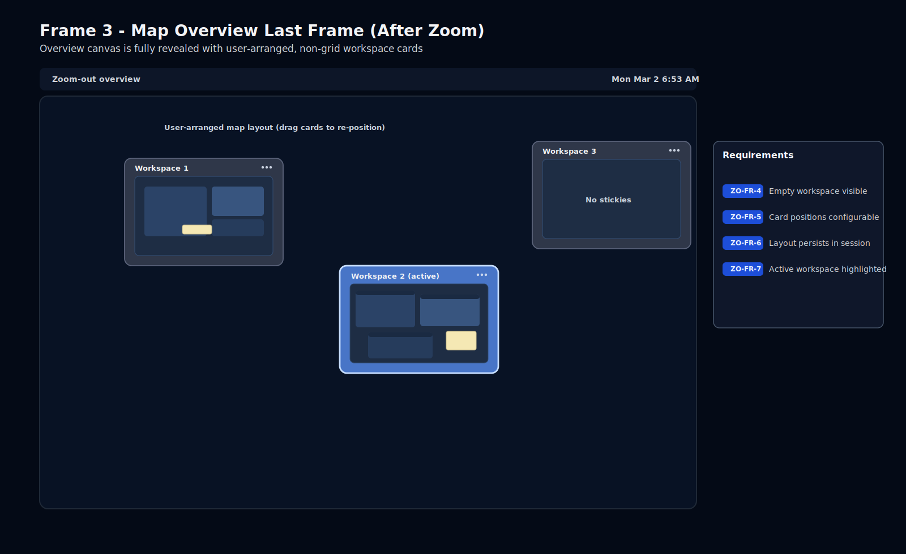
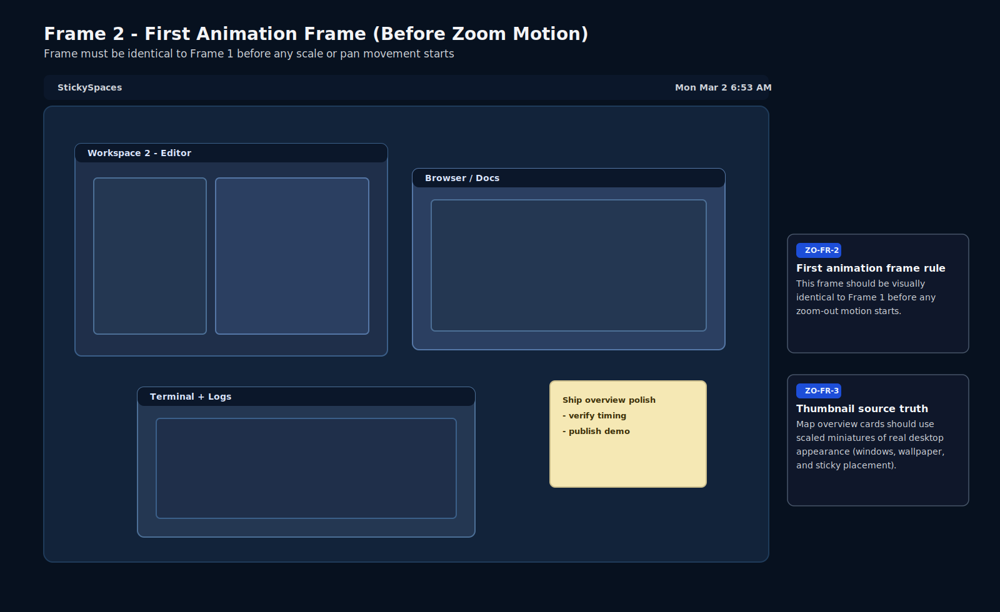
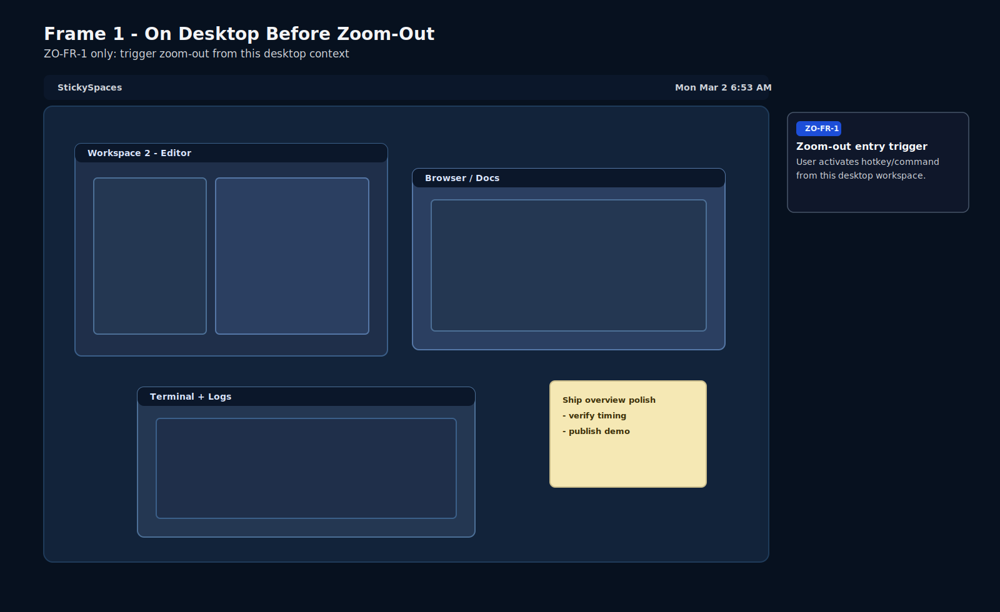
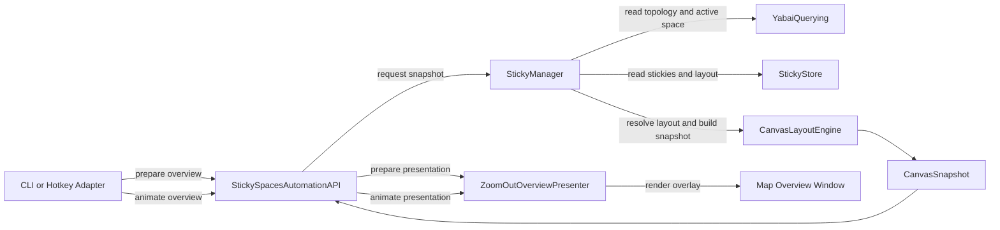
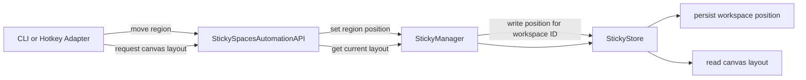
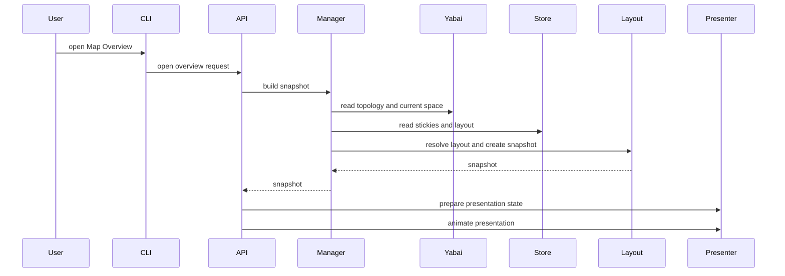

# Technical Specification: Map Overview Zoom Out (Story 3)

**Version**: 1.0  
**Date**: 2026-03-02  
**Quality Score**: 93/100  
**PRD Reference**: [StickySpaces PRD](stickyspaces-prd.md) - Story 3 ("Zoom Out - Show Me the Big Picture")

---

> **Note:** Canonical requirements have moved to [`openspec/specs/map-overview-zoom-out/spec.md`](../openspec/specs/map-overview-zoom-out/spec.md). This document is retained as architectural reference for design decisions, rationale, and implementation guidance.

## Overview

This document is a dedicated extraction of Story 3 from the StickySpaces PRD, focused on the Map Overview zoom-out experience only. It defines what is required for users to reliably see the full workspace landscape, preserve spatial memory cues, and maintain orientation.

This spec intentionally excludes Story 4 navigation semantics as delivery scope, while preserving interface compatibility so Story 4 can layer on without reworking Story 3 data contracts.

---

## Scope

### In Scope

- Triggering Map Overview from the current workspace
- Animated transition into the aggregate Map Overview canvas
- Rendering workspace regions as screenshot thumbnails with active-workspace highlighting
- Dragging workspace regions to rearrange the canvas
- Persisting workspace-region arrangement across repeated overview invocations in a session
- Deterministic snapshot/layout behavior for automation and testing

### Out of Scope

- Clicking a sticky to navigate to another workspace (Story 4)
- Zoom-in navigation orchestration and transition parity (Story 4)
- Dragging stickies between workspaces
- Cross-restart persistence of canvas layout
- Multi-display overview semantics beyond MVP single-display mode

---

## Requirements

### Functional Requirements

Figure 1 is the labeled Map Overview final-state mock for Story 3 (what users should actually see).



Figure 2 is the first-frame transition contract used to verify no visual jump before zoom motion starts.



- **ZO-FR-1**: A knowledge worker should be able to open Map Overview from the current workspace with a single hotkey/command, so they can access the big picture at the moment they need it.
- **ZO-FR-2**: A knowledge worker should be able to perceive current-workspace stickies shrinking in place into overview context, so spatial continuity preserves confidence during context expansion.
- **ZO-FR-3**: A knowledge worker should be able to see each supported workspace as a distinct bordered region rendered as a scaled screenshot thumbnail of that workspace's real desktop appearance (windows, wallpaper, and sticky placement), so they can recognize workspace intent without mental remapping.
- **ZO-FR-4**: A knowledge worker should be able to see empty workspaces as empty bordered regions, so the overview reflects full workspace topology and not only active sticky workspaces.
- **ZO-FR-5**: A knowledge worker should be able to drag workspace regions to arbitrary positions in the overview, so they can encode task relationships spatially.
- **ZO-FR-6**: A knowledge worker should be able to rely on region arrangement remaining stable across repeated zoom-out invocations in-session, so spatial memory compounds instead of resetting.
- **ZO-FR-7**: A knowledge worker should be able to identify the currently active workspace at a glance in overview mode, so they can quickly answer "where am I now?" before deciding what to do next.

#### Screen Sequence (Story 3 visual contract)

- **Frame A** ([SVG](map-overview-01-on-desktop.svg)): just before zoom-out is triggered.
  

- **Frame B** ([SVG](map-overview-02-first-frame-before-zoom.svg)): first frame of the zoom animation. The underlying product UI should be visually identical to Frame A before motion starts (annotation labels differ for readability).
  

- **Frame C** ([SVG](map-overview-03-last-frame-after-zoom.svg)): final frame of zoom-out, where overview cards are fully visible.
  

Visual contract: each workspace card in Frame C should be a scaled thumbnail of the workspace's real desktop appearance at zoom time, not an abstract placeholder card.

### Non-Functional Requirements

- **ZO-NFR-1**: The zoom-out transition should usually finish in 300~500ms p95, because it needs to feel responsive without moving so fast that users lose track of what they are seeing.
- **ZO-NFR-2**: If nothing has changed (same workspaces, same stickies, same layout), the overview should look the same every time it opens. Cards should not jump around or reorder unexpectedly, because consistency allows the user to reuse their spatial memory (method of loci).
- **ZO-NFR-3**: Bringing up the Map Overview should not edit sticky content/placement, or switch/create/destroy workspaces.
- **ZO-NFR-4**: Zoom-out automation should be designed to enable fast AI iteration loops: an AI agent can run the behavior, inspect structured results, make a change, and re-run without manual UI steps, because the primary goal of automation here is to let AI refine this feature quickly and safely.

### Constraints

- **ZO-C-1**: Overview workspace enumeration must stay within MVP primary-display semantics, because multi-display topology introduces ambiguity that is intentionally deferred.
- **ZO-C-2**: Workspace-region arrangement must remain session-scoped in memory for MVP, because cross-restart reconciliation is a separate risk area.
- **ZO-C-3**: Zoom-out preparation must fail gracefully with structured status/warnings when required yabai capabilities are unavailable, because silent or crashing failure breaks user trust.
- **ZO-C-4**: Story 3 delivery must not depend on Story 4 click-to-navigate behavior, because overview value must stand independently.

---

## Architecture & Design

### Existing Interfaces Reused

| Surface                                                                                                        | Responsibility                                                                                                     | Requirement Trace                    |
| -------------------------------------------------------------------------------------------------------------- | ------------------------------------------------------------------------------------------------------------------ | ------------------------------------ |
| `StickyManager.zoomOutSnapshot(viewport:)`                                                                     | Orchestrates topology + sticky reads, builds overview snapshot                                                     | ZO-FR-1, ZO-FR-3, ZO-FR-4, ZO-FR-7   |
| `CanvasLayoutEngine.resolveLayout(storedLayout:workspaces:)`                                                   | Preserves existing region positions and derives deterministic defaults for new spaces for render-time snapshot use | ZO-FR-5, ZO-FR-6, ZO-NFR-2, ZO-NFR-3 |
| `CanvasLayoutEngine.makeSnapshot(...)`                                                                         | Converts store/topology state to `CanvasSnapshot` with workspace screenshot-thumbnail metadata and invariants       | ZO-FR-3, ZO-FR-4, ZO-FR-7, ZO-NFR-3  |
| `StickyStore.canvasLayout` and `setWorkspacePosition`                                                          | Persists arrangement state for the current session                                                                 | ZO-FR-5, ZO-FR-6, ZO-C-2             |
| `ZoomOutOverviewPresenting` / `AppKitZoomOutOverviewPresenter`                                                 | Prepares and animates AppKit overlay from snapshot data                                                            | ZO-FR-2, ZO-NFR-1                    |
| `StickySpacesAutomationAPI` (`.prepareZoomOutOverview`, `.animatePreparedZoomOutOverview`, `.zoomOutSnapshot`) | Stable typed automation surface for tests/CLI                                                                      | ZO-FR-1, ZO-NFR-4                    |

### Map Overview Entry and Render Architecture



### Map Overview Layout Edit Architecture



### Design Decisions

- **D-ZO-1: Snapshot-first overview contract**
  - Build a full `CanvasSnapshot` before presentation and treat it as the single render contract.
  - Why: keeps rendering deterministic and testable, and avoids presenter-side hidden data pulls.
  - Trace: ZO-FR-1, ZO-FR-3, ZO-NFR-2, ZO-NFR-4.

- **D-ZO-2: Layout resolution before every snapshot**
  - Always run `resolveLayout` against live topology while building the snapshot, without mutating persistent user-visible state during overview entry.
  - Why: guarantees new workspaces appear predictably while preserving the read-only overview contract (transient presentation effects remain permitted).
  - Trace: ZO-FR-4, ZO-FR-5, ZO-FR-6.

- **D-ZO-3: Screenshot-thumbnail rendering contract**
  - Render each workspace region from screenshot-thumbnail data that reflects the real desktop composition at zoom-out time.
  - Why: avoids synthetic reconstructions drifting from what the user actually sees, and keeps the overview visually trustworthy.
  - Trace: ZO-FR-3, ZO-NFR-2, ZO-NFR-3.

- **D-ZO-4: Two-step presentation API (`prepare` then `animate`)**
  - Keep prepare and animation separable in automation.
  - Why: enables deterministic screenshot checkpoints and transition evidence capture.
  - Trace: ZO-FR-2, ZO-NFR-1, ZO-NFR-4.

### Story 3 Sequence



### Architectural Diff (Story 3 Surfaces)

```
Sources/
  StickySpacesShared/
    CanvasModels.swift
  StickySpacesApp/
    CanvasLayoutEngine.swift
    StickyManager.swift
    ZoomOutOverviewPresenter.swift
    StickySpacesAutomationAPI.swift
Tests/
  Product/CanvasOverviewBehaviorTests.swift
  Integration/IPCWorkflowTests.swift
  Integration/CLIWorkflowTests.swift
  E2E/ZoomOutCanvasOverviewJourneyTests.swift
```

### Risks and Assumptions

| Risk / Assumption                                                          | Impact                               | Mitigation                                                                              |
| -------------------------------------------------------------------------- | ------------------------------------ | --------------------------------------------------------------------------------------- |
| Hero-anchored transition feels discontinuous on some display/window states | Users lose spatial trust in zoom-out | Keep `prepare`/`animate` separable and retain screenshot/video evidence gate in E2E     |
| Missing empty-workspace rendering regresses silently                       | Users lose topology awareness        | Add explicit empty-workspace test coverage (see Test Plan gap closure)                  |
| Region drag persistence drifts under topology changes                      | Spatial arrangement feels unreliable | Resolve layout on every snapshot and prune stale IDs only after topology reconciliation |
| Yabai capability degradation during overview trigger                       | Overview appears flaky               | Surface structured mode/warnings and fail predictably without mutating store            |

---

## Test Specification

### Frame A/B Identity Test

- `ZoomOutCanvasOverviewJourneyTests.zoomOutFirstFrameMatchesPreZoomFrame`: capture Frame A (pre-zoom), call `prepare` (no animate), capture Frame B, then run pixel diff on a stable region of interest (exclude menu bar clock/cursor). Pass when changed-pixel ratio is <=0.1% and max per-channel delta is <=2.

### Requirement Coverage Matrix

| Requirement                                            | Tests                                                                                                                                                                                                                                                                         |
| ------------------------------------------------------ | ----------------------------------------------------------------------------------------------------------------------------------------------------------------------------------------------------------------------------------------------------------------------------- |
| ZO-FR-1 (trigger overview)                             | `CLIWorkflowTests.userZoomsOutAndSeesCanvasContextInOutput`, `CLIWorkflowTests.userZoomsOutTwiceAndReceivesDeterministicCanvasSnapshotMetadata`, `ZoomOutCanvasOverviewJourneyTests.multiWorkspaceZoomOutCanvasOverviewProducesSnapshotAndVideoArtifact`                      |
| ZO-FR-2 (shrink-in-place continuity)                   | `ZoomOutCanvasOverviewJourneyTests.multiWorkspaceZoomOutCanvasOverviewProducesSnapshotAndVideoArtifact` + **add** `ZoomOutCanvasOverviewJourneyTests.zoomOutFirstFrameMatchesPreZoomFrame` + **add** `ZoomOutCanvasOverviewJourneyTests.zoomOutAnimationPreservesHeroAnchorContinuity` |
| ZO-FR-3 (workspace regions + screenshot thumbnails)    | `CanvasOverviewBehaviorTests.threeWorkspacesRenderAsNonOverlappingOverviewRegions`, `CanvasOverviewBehaviorTests.zoomOutSnapshotUsesSyntheticThumbnailMetadataByDefault` + **add** `ZoomOutCanvasOverviewJourneyTests.zoomOutFinalFrameShowsScaledWorkspaceScreenshots`      |
| ZO-FR-4 (empty workspace regions)                      | **add** `CanvasOverviewBehaviorTests.zoomOutSnapshotIncludesEmptyWorkspaceRegions`                                                                                                                                                                                            |
| ZO-FR-5 (drag region)                                  | `CLIWorkflowTests.userMovesRegionAndCanvasLayoutPersistsAcrossRepeatedReads`                                                                                                                                                                                                  |
| ZO-FR-6 (arrangement persistence)                      | `CanvasOverviewBehaviorTests.canvasLayoutPreservesCustomWorkspacePositions`, `CanvasOverviewBehaviorTests.repeatedZoomOutSnapshotsAreDeterministic`, `CLIWorkflowTests.userMovesRegionAndCanvasLayoutPersistsAcrossRepeatedReads`                                             |
| ZO-FR-7 (active highlight)                             | `CanvasOverviewBehaviorTests.activeWorkspaceHighlightFollowsCurrentWorkspace`, `CanvasOverviewBehaviorTests.activeWorkspaceHighlightIsVisibleInTheCanvas`                                                                                                                     |
| ZO-NFR-1 (300-500ms transition)                        | **add** `ZoomOutCanvasOverviewJourneyTests.zoomOutTransitionDurationWithin300To500msP95`                                                                                                                                                                                      |
| ZO-NFR-2 (determinism)                                 | `CanvasOverviewBehaviorTests.repeatedZoomOutSnapshotsAreDeterministic`, `CLIWorkflowTests.userZoomsOutTwiceAndReceivesDeterministicCanvasSnapshotMetadata`                                                                                                                    |
| ZO-NFR-3 (read-only persistent state)                  | `CanvasOverviewBehaviorTests.overviewModeDoesNotMutateStickyTextOrPosition` + **add** `ZoomOutCanvasOverviewJourneyTests.zoomOutDoesNotSwitchWorkspace` + **add** `ZoomOutCanvasOverviewJourneyTests.zoomOutPresentationMutationsAreTransient`                                |
| ZO-NFR-4 (typed automation)                            | `CLIWorkflowTests.userZoomsOutAndSeesCanvasContextInOutput`, `CLIWorkflowTests.userZoomsOutTwiceAndReceivesDeterministicCanvasSnapshotMetadata` + **add** `IPCWorkflowTests.zoomOutReturnsCanvasSnapshotOverIPC`                                                            |
| ZO-C-1 / ZO-C-3 (mode + degraded behavior)             | **add** `CanvasOverviewBehaviorTests.zoomOutReturnsUnsupportedModeOnCapabilityLoss` + **add** `IPCWorkflowTests.zoomOutReportsStructuredModeWarnings`                                                                                                                         |

### Representative Test Case

```swift
@Test("Overview snapshot layout, thumbnails, and active highlight remain stable")
func overviewSnapshotLayoutThumbnailsAndHighlightRemainStable() async throws {
    // 1) Build topology with 3 workspaces, create stickies on 2 workspaces
    // 2) Capture baseline zoomOutSnapshot()
    // 3) Repeat snapshot 10x without mutations
    // 4) Assert:
    //    - regions remain non-overlapping
    //    - active workspace remains uniquely highlighted
    //    - workspace screenshot-thumbnail metadata remains stable and non-empty
    //    - snapshots are equal across repetitions
}
```

### Additional Test Cases to Implement

- `CanvasOverviewBehaviorTests.zoomOutSnapshotIncludesEmptyWorkspaceRegions`
- `ZoomOutCanvasOverviewJourneyTests.zoomOutTransitionDurationWithin300To500msP95`
- `ZoomOutCanvasOverviewJourneyTests.zoomOutFinalFrameShowsScaledWorkspaceScreenshots`
- `ZoomOutCanvasOverviewJourneyTests.zoomOutFirstFrameMatchesPreZoomFrame`
- `ZoomOutCanvasOverviewJourneyTests.zoomOutAnimationPreservesHeroAnchorContinuity`

---

## Delivery Plan

### Phase 0: Story 3 Risk Probe (thin vertical slice)

**Goal**: Prove transition continuity and overlay viability before broadening behavior.

- Wire `prepare` + `animate` overview path end-to-end with one workspace.
- Capture before/after screenshots and one short video artifact through existing harness.
- Validate transition lands within 300-500ms target range on baseline machine.

**Acceptance**:

- `ZoomOutCanvasOverviewJourneyTests.multiWorkspaceZoomOutCanvasOverviewProducesSnapshotAndVideoArtifact` passes with artifacts.
- No blank frame or stuck overlay during animation.
- Initial duration samples fit target envelope.
- Frame A/B identity gate passes on stable ROI (changed-pixel ratio <=0.1%, max per-channel delta <=2).

### Phase 1: Snapshot Correctness (first independently valuable story slice)

**Goal**: Deliver accurate overview state even before drag customization.

- Ensure all supported workspaces render as regions (including empty ones).
- Ensure active workspace highlight and screenshot-thumbnail fidelity are correct.
- Ensure deterministic snapshot output under stable inputs.

**Acceptance**:

- Region count matches supported workspace count.
- Active highlight is unique and correct.
- Repeated snapshots are byte-for-byte equivalent for unchanged state.

### Phase 2: Region Rearrangement + Session Persistence

**Goal**: Deliver user-controlled spatial arrangement memory cues.

- Support region drag updates through `move-region` and automation command path.
- Persist arrangement in `StickyStore.canvasLayout` for session lifetime.
- Maintain deterministic layout after manual moves.

**Acceptance**:

- Moving region coordinates is reflected in subsequent `canvas-layout` reads.
- Re-opening overview preserves moved positions for 20 repeated invocations.

### Phase 3: Hardening and Story 3 Quality Gates

**Goal**: Make overview reliable under real usage and CI.

- Add missing Story 3 tests (`empty regions`, `duration p95`, `thumbnail fidelity`, `frame A/B identity`, `hero-anchor continuity`).
- Gate degraded-mode behavior for zoom-out commands (structured warnings/errors).
- Keep overview read-only for persistent user-visible state, while allowing only transient presentation-layer effects needed for animation.

**Acceptance**:

- Story 3 coverage matrix has no uncovered requirements.
- Added Story 3 tests pass 3 consecutive runs without flakes.
- No persistent user-visible state mutation (stickies, workspace topology, or final settled window state) across repeated zoom-out entry/render operations.

### Task Sizing and Parallelism

- Each phase is executable in <=200k-token AI sessions by constraining to a small set of files and explicit acceptance checks.
- After Phase 1 locks snapshot contracts, Phase 2 (interaction) and Phase 3 test hardening can run in parallel.

---

## Quality Score Breakdown

Tech Spec Quality Score: **93/100**

- **Requirements: 29/30**
  - Story 3 acceptance criteria fully mapped to requirement IDs.
  - Rationales are explicit and business-aligned.
  - Requirements are testable and solution-agnostic.
  - Minor deduction: one implied requirement (empty workspaces) is inferred from feature edge cases, not a direct Story 3 bullet.

- **Architecture & Design: 28/30**
  - Every design decision traces to requirement IDs.
  - Existing real interfaces/components are used directly.
  - Architectural diff is explicit and implementation-ready.
  - Minor deduction: Story 3/Story 4 boundary leaves one transition ownership seam that may need a follow-up ADR.

- **Test Specification: 18/20**
  - Matrix covers all requirements with concrete test names.
  - Includes depth pattern plus breadth inventory.
  - Minor deduction: several tests are newly proposed and not yet implemented.

- **Delivery Plan: 18/20**
  - Vertical slices are independently valuable and risk-first.
  - Acceptance checks are concrete and automation-friendly.
  - Parallelism is enabled after snapshot contracts stabilize.
  - Minor deduction: duration gate baselines may vary by hardware and may require environment normalization policy.

---

## Clarification Questions (Next Iteration)

1. For Story 3 sign-off, should transition continuity be judged purely by measurable anchors/duration, or does it require subjective visual review each release?
2. Should Story 3 require drag interactions in the AppKit overlay itself, or is CLI/API-backed `move-region` sufficient for MVP acceptance?
3. Do you want Story 3 to include explicit topology health-flap fault injection, or leave that exclusively in the broader hardening track?
