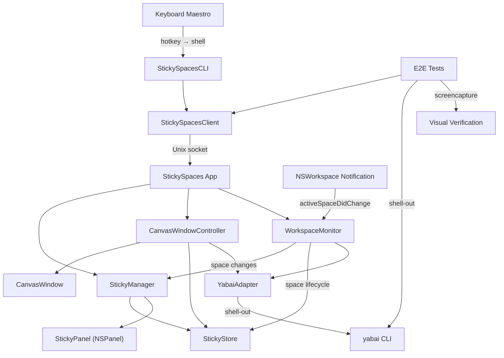

# Technical Specification: StickySpaces

**Version**: 1.0
**Date**: 2026-02-26
**Quality Score**: 96/100
**PRD Reference**: [StickySpaces PRD](proposal.md)
**Spec**: [spec.md](../../../specs/core/spec.md)

## Overview

StickySpaces is a native macOS app that places persistent, chromeless sticky notes on each workspace so users can recover intent at a glance. It targets users with ADHD or limited working memory who encounter valuable side tasks during focused work and lose track of the original goal when they pursue them. When the user returns to a workspace, the sticky should immediately answer: "What am I doing here?"

MVP integrates with yabai for Space detection/switching and is triggered through Keyboard Maestro -> CLI. A zoom-out canvas shows all supported workspaces in a spatial layout and enables sticky-click navigation. In MVP, "all workspaces" means all Spaces on the primary display only (intentional scope cut to de-risk multi-display semantics).

Core technical challenges are (1) making `NSPanel` reliably behave as a Space-bound non-activating floating panel and (2) creating smooth panel<->canvas zoom transitions with deterministic geometry.

The app exposes a programmatic CLI API over a Unix domain socket with write commands (create, edit, move, dismiss) and read queries (list, get, status). This supports AI-agent-driven development and testing: E2E tests use Swift/XCTest, the shared client library, yabai queries, and `screencapture` artifacts.

### MVP Scope & Interpretation Decisions

- **A-1 (Display scope interpretation):** PRD references "all workspaces" at user level; for MVP this spec intentionally interprets that as all Spaces in the supported display set (primary display only per `C-5`). This is a deliberate scope cut to avoid high-risk multi-display semantics in MVP.
- **A-2 (Navigation interaction contract):** Sticky-click navigation is required for MVP (`FR-8`); region-click is explicitly out of MVP scope.
- **A-3 (Workspace deletion safety):** PRD requires deletion on workspace destruction; MVP implements conservative confirmation (`FR-11`, `D-11`) to prevent irreversible false-positive deletes during transient topology inconsistencies.

---

## Requirements

### Functional Requirements

- **FR-1**: A knowledge worker should be able to create a floating sticky note on the current workspace via a hotkey — _because returning to a workspace should require zero effort to re-orient, eliminating the "what was I doing?" reconstruction tax._
- **FR-2**: A knowledge worker should be able to see their stickies immediately when switching to a workspace, with no action required — _because orientation should be a glance, not a deliberate act of recall._
- **FR-3**: A knowledge worker should be able to edit sticky text directly in-place, with the cursor ready immediately after creation — _because intentions evolve as work progresses, and stickies must reflect current state to remain useful._
- **FR-4**: A knowledge worker should be able to reposition and resize stickies by dragging — _because different workflows need different screen layouts, and stickies must not obscure critical content._
- **FR-5**: A knowledge worker should be able to have multiple stickies per workspace — _because a single workspace may involve multiple sub-tasks or coordination notes._
- **FR-6**: A knowledge worker should be able to dismiss a sticky — _because completed tasks clutter the view and erode the glanceability that makes stickies useful._
- **FR-7**: A knowledge worker should be able to zoom out to see all supported workspaces and their stickies in one spatial canvas (MVP scope: primary display Spaces only) — _because understanding the full landscape of work reduces "what else was I doing?" anxiety and enables better prioritization._
- **FR-8**: A knowledge worker should be able to navigate to any workspace by clicking its sticky in the zoom-out canvas — _because spatial navigation ("click the one on the left") is lower cognitive load than recalling workspace numbers._
- **FR-9**: A knowledge worker should be able to freely arrange workspace regions on the zoom-out canvas — _because spatial arrangement lets users encode task relationships (grouping related work together), leveraging their strong spatial memory._
- **FR-10**: A knowledge worker should be able to see which workspace is currently active in the zoom-out canvas — _because knowing "where I am now" is the anchor for deciding "where to go next."_
- **FR-11**: When a workspace is destroyed, its stickies should disappear from user-visible surfaces immediately and be hard-deleted only after conservative topology confirmation — _because orphaned stickies are confusing, but false-positive hard deletion would cause irreversible context loss._

### Non-Functional Requirements

- **NFR-1**: Sticky creation must complete in <100ms from hotkey press to visible panel — _because any perceptible delay breaks the "zero-friction capture" promise and discourages use at the critical moment of intention-setting._
- **NFR-2**: Zoom-out/zoom-in animations must complete within 300–500ms — _because the animation must be fast enough to feel responsive but slow enough to maintain spatial continuity (the user needs to see where things are moving from/to)._
- **NFR-3**: Memory footprint must stay under 30MB for typical usage (5–10 workspaces, 1–5 stickies each) — _because this is a background utility that must never compete with the user's actual work apps for system resources._
- **NFR-4**: A developer should be able to add a new CLI command within 1 hour — _because the CLI is the primary integration surface for Keyboard Maestro, automation, and testing, and the command set will grow across phases._
- **NFR-5**: The project structure, build system, and test infrastructure must be fully operable through text file manipulation and CLI commands, with no dependency on GUI tools — _because the primary development workflow is AI-agent-driven, and agents cannot interact with Xcode's GUI or manipulate opaque binary project files._
- **NFR-6**: Default sticky styling must be readable at a glance (minimum 14pt effective text size, high-contrast foreground/background, and no decorative chrome) — _because re-orientation fails if users must squint or parse visual noise after every context switch._
- **NFR-7**: App/CLI IPC compatibility must be explicit and versioned (server supports protocol version N and N-1) — _because automation environments commonly drift binaries, and silent wire incompatibility causes fragile behavior and emergency rewrites._

### Constraints

- **C-1**: Floating panels must appear chrome-less (no title bar), stay above application windows, and remain bound to a single macOS Space — _because orientation requires stickies to be visible at a glance without obscuring system UI, and workspace-binding is what makes a sticky an answer to "what am I doing HERE" rather than a generic note._
- **C-2**: The app must handle yabai being temporarily unavailable without crashing — _because yabai restarts after macOS updates, and loss of yabai must not destroy in-session stickies._
- **C-3**: MVP data must be session-scoped (in-memory only, no disk persistence) — _because yabai space IDs are unstable across reboots, making cross-restart reconciliation unreliable without a dedicated design effort._
- **C-4**: Must support macOS Ventura 13.0+ — _because this is the minimum version supporting the required NSPanel behaviors and yabai compatibility._
- **C-5**: MVP assumes a single-display configuration. On multi-display setups, the app enters explicit Single-Display Mode bound to a latched `primaryDisplayID` captured at startup — `WorkspaceMonitor` filters `allSpaces()` strictly by that ID, stickies are positioned in the primary-display coordinate system, and commands from non-primary-display contexts return a structured unsupported-mode error — _because multi-display Space management introduces per-display space sets, ambiguous "current workspace" semantics, and cross-display coordinate transforms that are orthogonal to the core product hypothesis._
- **C-6**: MVP must remain fully local: no outbound network calls and no telemetry — _because this is a personal productivity utility handling sensitive in-progress work context, and users must trust that all data stays on-device._
- **C-7**: Missing system prerequisites (Accessibility permission, Keyboard Maestro wiring, or yabai availability) must fail gracefully with actionable remediation steps — _because onboarding friction is expected, and silent failure would feel like data loss or random breakage._
- **C-8**: On startup, the app must run a yabai capability probe (`currentSpace`, `allSpaces`, `focusSpace`, lifecycle diff fidelity) and expose capability-scoped degraded behavior (not a single opaque degraded bucket) — _because external dependency drift is expected and must not silently corrupt workspace state._
- **C-9**: The app must enforce single-instance authority over the Unix socket and in-memory store; second launch attempts must fail safely with actionable output — _because split-brain control planes can make stickies appear lost or uncontrollable._

---

## Architecture

### System Context

StickySpaces is a native macOS agent app (no Dock icon) that:

- Receives commands from **Keyboard Maestro** → **stickyspaces CLI** via a Unix domain socket
- Communicates with **yabai** via CLI shell-out for workspace detection and switching
- Renders floating panels using **AppKit** (NSPanel) and animations using **Core Animation**
- Exposes a typed query API for autonomous E2E testing via the same Unix socket

### High-Level Design



Reader guide: if you are skimming, read `Key Architectural Decisions` first, then use `Component Breakdown`, `Data Model`, and `API & Interface Design` as implementation detail references.

### Component Breakdown

| Component | Responsibility | Justification |
| --- | --- | --- |
| `WorkspaceID` | Wrapper type for yabai space `id` (session-stable identity); `Hashable`, `Codable`, `Sendable` | Prevents accidental use of mutable routing fields (space index) as canonical identity |
| `StickyNote` | Value type: text, position, size, workspace ID, display ID, timestamp; `Sendable` | FR-1, FR-3, FR-4, C-5 |
| `CanvasLayout` | Value type: workspace positions on zoom-out canvas + display bindings; `Sendable` | FR-9, C-5 |
| `StickySpacesError` | Domain error enum: `.stickyNotFound`, `.yabaiUnavailable`, etc. | C-2 (structured error handling for graceful degradation) |
| `IPCRequest` / `IPCResponse` | Typed `Codable` enums for IPC wire protocol (in `StickySpacesShared`) | NFR-4 (compile-time exhaustiveness; catches schema drift) |
| `StickyStoring` (protocol) / `StickyStore` (actor) | In-memory CRUD for stickies + canvas layout; actor for thread-safe shared state | C-3, FR-5, FR-9, FR-11, D-7 |
| `YabaiQuerying` / `YabaiCommanding` (protocols) | Query spaces (read) / focus space (write); split for CQRS clarity | C-2 (abstraction enables graceful degradation) |
| `WorkspaceMonitor` | Observes workspace changes via NSWorkspace notification + periodic reconciliation; emits current-space changes | FR-2 |
| `WorkspaceTopologyReconciler` | Single authority that diffs known spaces vs yabai and applies add/remove semantics to `StickyStore` | FR-11, prevents duplicate lifecycle logic |
| `StickyPanel` | NSPanel subclass: borderless, floating, non-activating; `@MainActor` | C-1 |
| `PanelVisibilityStrategy` (protocol) | Handles panel show/hide on workspace switch. `AutomaticVisibility` (no-op if D-3 holds) or `ManualVisibility` (explicit show/hide as fallback) | C-1, FR-2 (Phase 0 spike determines which implementation to use) |
| `StickyManager` | Creates/destroys StickyPanels, delegates workspace-switch visibility to injected `PanelVisibilityStrategy`; `@MainActor` | FR-1, FR-2, FR-6 |
| `CanvasView` | Custom NSView: zoomable/pannable canvas with workspace regions; renders stickies at full fidelity (zoom ≥ 1.0) or miniature (zoomed out), using shared rendering code with `StickyPanel` | FR-7, FR-8, FR-9, FR-10 |
| `CanvasWindowController` | Canvas window (`.canJoinAllSpaces`), viewport-animation zoom transitions, panel↔canvas coordinate alignment, sticky-click navigation | FR-7, FR-8, NFR-2 |
| `IPCServer` | Unix domain socket listener, routes `IPCRequest` → handler → `IPCResponse` | NFR-4 |
| `StickySpacesClient` | Typed async Swift API over Unix socket (shared by CLI + E2E tests) | NFR-4, enables autonomous testing |
| `YabaiClient` | Typed wrapper for yabai CLI queries (shared by client library) | Enables E2E assertions on window state |
| `AppDelegate` | App lifecycle, component wiring | — |

### Directory Structure

```
StickySpaces/
├── Package.swift                                # SPM: 4 library/executable targets + 2 test targets
├── Sources/
│   ├── StickySpacesShared/                      # Shared library (models + IPC protocol types)
│   │   ├── WorkspaceID.swift                    # Typed wrapper for yabai space id (canonical identity)
│   │   ├── StickyNote.swift                     # Sticky data model
│   │   ├── CanvasLayout.swift                   # Canvas workspace positions
│   │   ├── StickySpacesError.swift              # Domain error enum
│   │   └── IPCProtocol.swift                    # IPCRequest/IPCResponse Codable enums
│   ├── StickySpacesApp/                         # Main app (macOS agent, no Dock icon)
│   │   ├── main.swift                           # NSApplication setup + run loop
│   │   ├── AppDelegate.swift                    # Lifecycle, component wiring
│   │   ├── IPC/
│   │   │   └── IPCServer.swift                  # Unix socket listener + request routing
│   │   ├── Store/
│   │   │   ├── StickyStoring.swift              # Protocol for testability
│   │   │   └── StickyStore.swift                # Actor: in-memory CRUD
│   │   ├── Panels/
│   │   │   ├── StickyPanel.swift                # NSPanel subclass (@MainActor)
│   │   │   └── StickyTextView.swift             # Editable text field
│   │   ├── Canvas/
│   │   │   ├── CanvasView.swift                 # Aggregate view with workspace regions
│   │   │   ├── CanvasWindowController.swift     # Window + viewport-animation zoom transitions
│   │   │   ├── CanvasLayoutEngine.swift         # Frame computation for workspace regions
│   │   │   └── WorkspaceRegionView.swift        # Single workspace region on canvas
│   │   ├── Services/
│   │   │   ├── YabaiAdapter.swift               # YabaiQuerying/YabaiCommanding protocols + impl
│   │   │   ├── WorkspaceMonitor.swift           # Workspace change observer
│   │   │   └── WorkspaceTopologyReconciler.swift # Space add/remove diff + sticky pruning authority
│   │   └── StickyManager.swift                  # Panel lifecycle manager (@MainActor)
│   ├── StickySpacesCLI/                         # CLI executable (swift-argument-parser)
│   │   └── StickySpacesCLI.swift                # ParsableCommand structs
│   └── StickySpacesClient/                      # Shared library (used by CLI + E2E tests)
│       ├── StickySpacesClient.swift             # Typed async API: new(), edit(), list(), etc.
│       └── YabaiClient.swift                    # Typed yabai queries for E2E assertions
├── Tests/
│   ├── UnitTests/                               # Hermetic tests, no external dependencies
│   │   ├── StickyStoreTests.swift
│   │   ├── StickyManagerTests.swift
│   │   ├── CanvasLayoutTests.swift
│   │   └── Helpers/
│   │       └── MockYabaiAdapter.swift           # Conforms to YabaiQuerying & YabaiCommanding
│   └── E2ETests/                                # Requires running app + yabai
│       ├── StickyLifecycleE2ETests.swift
│       ├── WorkspaceBindingE2ETests.swift
│       ├── CanvasE2ETests.swift
│       └── Helpers/
│           └── E2ETestCase.swift                # Base class: setup/teardown, screenshot capture
```

### Data Model

```swift
struct WorkspaceID: Hashable, Codable, Sendable, RawRepresentable {
    let rawValue: Int
}

struct StickyNote: Identifiable, Codable, Sendable {
    let id: UUID
    var text: String
    var position: CGPoint
    var size: CGSize
    let workspaceID: WorkspaceID
    let displayID: Int
    let createdAt: Date
}

struct CanvasLayout: Codable, Sendable {
    var workspacePositions: [WorkspaceID: CGPoint]
    var workspaceDisplayIDs: [WorkspaceID: Int]
}
```

**Error types:**

```swift
enum StickySpacesError: Error {
    case stickyNotFound(UUID)
    case workspaceNotFound(WorkspaceID)
    case yabaiUnavailable(underlying: Error)
    case socketConnectionFailed(underlying: Error)
    case invalidRequest(String)
}
```

```swift
enum RuntimeMode: String, Codable, Sendable {
    case normal
    case singleDisplay
    case degraded
}

struct CapabilityState: Codable, Sendable {
    let canReadCurrentSpace: Bool
    let canListSpaces: Bool
    let canFocusSpace: Bool
    let canDiffTopology: Bool
}
```

**IPC Protocol (typed request/response):**

All requests and responses are newline-delimited JSON over the socket. The wire format is derived from these `Codable` enums — exhaustive `switch` on the server side ensures every command is handled, and schema drift between client and server is caught at compile time.

```swift
enum IPCRequest: Codable, Sendable {
    case hello(protocolVersion: Int)
    case new(text: String?, x: CGFloat?, y: CGFloat?)
    case edit(id: UUID, text: String)
    case move(id: UUID, x: CGFloat, y: CGFloat)
    case resize(id: UUID, width: CGFloat, height: CGFloat)
    case dismiss(id: UUID)
    case dismissAll
    case zoomOut
    case zoomIn(space: WorkspaceID)
    case list(space: WorkspaceID?)
    case get(id: UUID)
    case canvasLayout
    case moveRegion(space: WorkspaceID, x: CGFloat, y: CGFloat)
    case status
    case verifySync
}

enum IPCResponse: Codable, Sendable {
    case hello(
        serverProtocolVersion: Int,
        minSupportedClientVersion: Int,
        capabilities: CapabilityState
    )
    case protocolMismatch(
        serverProtocolVersion: Int,
        minSupportedClientVersion: Int,
        message: String
    )
    case created(id: UUID, workspaceID: WorkspaceID)
    case ok
    case sticky(StickyNote)
    case stickyList([StickyNote])
    case canvasLayout(CanvasLayout)
    case status(
        running: Bool,
        space: WorkspaceID?,
        stickyCount: Int,
        mode: RuntimeMode,
        warnings: [String]
    )
    case unsupportedMode(code: String, message: String)
    case syncResult(synced: Bool, mismatches: [String])
    case error(String)
}
```

Data flow: CLI command → `StickySpacesClient` → Unix socket → `IPCServer` → `StickyManager` → `StickyStore` (write) / `StickyPanel` (render). Queries reverse the flow: `IPCServer` reads from `StickyStore` and returns JSON. All IPC messages are encoded/decoded via the `IPCRequest`/`IPCResponse` enums.

### API & Interface Design

**Unix Domain Socket IPC**

Socket path: `~/.config/stickyspaces/sock`

All requests and responses are newline-delimited JSON over the socket, encoded/decoded via the `IPCRequest`/`IPCResponse` enums defined in the Data Model section. The wire schema is versioned and stable (manual `Codable` mapping in `StickySpacesShared`, not implicit enum-synthesis shape). Clients MUST use `StickySpacesClient` (which encodes/decodes via the shared types) rather than hand-crafting JSON.

**Protocol handshake and compatibility policy:**

- `StickySpacesClient` sends `.hello(protocolVersion:)` before the first request on a connection.
- Server responds with `.hello(serverProtocolVersion:minSupportedClientVersion:capabilities:)`.
- If incompatible, server responds with `.protocolMismatch(...)`, client prints actionable upgrade guidance, and exits non-zero.
- Compatibility policy: server supports protocol versions `N` and `N-1` only (`N` = server protocol version).

**Write commands (actions):**

| CLI Command | IPCRequest case | IPCResponse case |
| --- | --- | --- |
| `stickyspaces new [--text T] [--x X --y Y]` | `.new(text:x:y:)` | `.created(id:workspaceID:)` |
| `stickyspaces edit <id> --text T` | `.edit(id:text:)` | `.ok` |
| `stickyspaces move <id> --x X --y Y` | `.move(id:x:y:)` | `.ok` |
| `stickyspaces resize <id> --width W --height H` | `.resize(id:width:height:)` | `.ok` |
| `stickyspaces dismiss <id>` | `.dismiss(id:)` | `.ok` |
| `stickyspaces dismiss-all` | `.dismissAll` | `.ok` |
| `stickyspaces zoom-out` | `.zoomOut` | `.ok` |
| `stickyspaces zoom-in --space N` | `.zoomIn(space:)` | `.ok` |
| `stickyspaces move-region --space N --x X --y Y` | `.moveRegion(space:x:y:)` | `.ok` |

**Read commands (queries):**

| CLI Command | IPCRequest case | IPCResponse case |
| --- | --- | --- |
| `stickyspaces list [--space N]` | `.list(space:)` | `.stickyList([StickyNote])` |
| `stickyspaces get <id>` | `.get(id:)` | `.sticky(StickyNote)` |
| `stickyspaces canvas-layout` | `.canvasLayout` | `.canvasLayout(CanvasLayout)` |
| `stickyspaces status` | `.status` | `.status(running:space:stickyCount:mode:warnings:)` |
| `stickyspaces verify-sync` | `.verifySync` | `.syncResult(synced:mismatches:)` |

`WorkspaceID` values in CLI/API map to yabai space `id` (canonical identity), not mutable space index. The app resolves the latest index internally when issuing focus commands.

Operational-mode signaling is structured:

- `status` returns `mode` (`normal`, `singleDisplay`, or `degraded`) plus machine-readable warning strings.
- `status` also includes capability-derived behavior context (`CapabilityState`) via handshake response; clients cache and surface this when commands are unavailable.
- Commands blocked by mode constraints return `.unsupportedMode(code:message:)` instead of generic `.error(String)`.
- Command gating is capability-scoped:
  - `new/edit/move/resize/dismiss/list/get`: require `canReadCurrentSpace`
  - `zoom-in` and canvas navigation: require `canFocusSpace`
  - topology-dependent cleanup paths: require `canDiffTopology`
  - space-list/canvas synthesis paths: require `canListSpaces`

**`verifySync` Semantics:**

`verifySync` compares the `StickyStore` state to live `StickyPanel` state on the main thread. It only verifies panels on the **current workspace** — panels on other Spaces are not visible and their frame state may be stale. For each sticky on the current workspace in the store, it checks:

1. A corresponding `StickyPanel` exists (keyed by sticky ID)
2. Panel frame origin matches `sticky.position` within 1pt tolerance (window server rounding)
3. Panel frame size matches `sticky.size` within 1pt tolerance
4. Panel text content equals `sticky.text` exactly

Mismatches are returned as human-readable strings, e.g., `"sticky <id>: position (100.0, 200.0) != panel (101.0, 199.0)"`. `synced` is `true` only when the mismatch list is empty. E2E tests that need to verify stickies on multiple workspaces should navigate to each workspace and call `verifySync` after each switch.

**CLI Error Handling & Socket Lifecycle:**

When `StickySpacesClient` fails to connect to the Unix socket (connection refused or socket file absent), it throws `StickySpacesError.socketConnectionFailed` with a user-facing message: `"StickySpaces is not running. Launch StickySpaces.app first."` The CLI prints this to stderr and exits with code 1.

If handshake fails with `.protocolMismatch(...)`, CLI prints: `"StickySpaces protocol mismatch (client X, server supports Y..Z). Update app/CLI to matching versions."` and exits non-zero.

If app startup fails single-instance lock acquisition, the second launch prints: `"StickySpaces is already running (pid <pid>). Reuse existing instance."` and exits non-zero without modifying socket state.

Socket lifecycle:
- **Single-instance authority**: app acquires an exclusive lock file (`~/.config/stickyspaces/instance.lock`) before starting `IPCServer`; if lock acquisition fails, second launch exits with actionable message and does not touch socket state.
- **On launch**: stale socket unlink is allowed only after ownership verification (owner PID dead or lock absent). Never unlink a socket owned by a live process.
- **On termination**: `AppDelegate.applicationWillTerminate` removes socket and releases instance lock.
- **On signal** (SIGINT/SIGTERM): signal handler performs POSIX cleanup (`unlink` socket path + lock file) before exit.

**YabaiAdapter Protocols:**

```swift
protocol YabaiQuerying: Sendable {
    func currentSpaceID() async throws -> WorkspaceID
    func allSpaces() async throws -> [YabaiSpace]
}

protocol YabaiCommanding: Sendable {
    func focusSpace(_ spaceID: WorkspaceID) async throws
}

typealias YabaiAdapting = YabaiQuerying & YabaiCommanding

struct YabaiSpace: Codable, Sendable {
    let id: WorkspaceID
    let index: Int
    let isVisible: Bool
    let display: Int
}
```

`WorkspaceID` is the canonical key used in the store, canvas layout, and IPC types. `YabaiSpace.index` is treated as a mutable routing field only. `YabaiCommanding.focusSpace(_:)` resolves the latest `index` for a given `WorkspaceID` before issuing `yabai -m space --focus`, so in-session index renumbering does not rebind sticky ownership.

Yabai shell-out execution policy:

- `currentSpaceID` timeout: 250ms
- `allSpaces` timeout: 400ms
- `focusSpace` timeout: 750ms
- On timeout, subprocess is terminated and surfaced as structured timeout error.
- Consecutive timeout threshold (2) transitions relevant capabilities to unavailable, updating runtime mode/status via D-13.

**StickyStore Interface:**

```swift
protocol StickyStoring: Sendable {
    func create(for workspaceID: WorkspaceID, text: String, position: CGPoint?, size: CGSize?) async -> StickyNote
    func stickies(for workspaceID: WorkspaceID) async -> [StickyNote]
    func allStickies() async -> [StickyNote]
    func sticky(withID id: UUID) async -> StickyNote?
    func update(_ sticky: StickyNote) async
    func remove(_ stickyID: UUID) async
    func removeAll(for workspaceID: WorkspaceID) async
    func removeAll() async
    func canvasLayout() async -> CanvasLayout
    func setWorkspacePosition(_ workspaceID: WorkspaceID, position: CGPoint) async
}

actor StickyStore: StickyStoring {
    // In-memory CRUD + canvas layout, serialized access via actor isolation
}
```

**YabaiClient Interface (client library — for E2E test assertions):**

The `YabaiClient` in the client library is distinct from the app-internal `YabaiAdapter`. It provides read-only yabai queries used by E2E tests to assert on system-level window state. It shells out to `yabai -m query --windows` and filters results.

```swift
struct YabaiClient: Sendable {
    func currentSpaceID() async throws -> WorkspaceID
    func allSpaces() async throws -> [YabaiSpace]
    func windows(app: String, space: WorkspaceID) async throws -> [YabaiWindow]
}

struct YabaiWindow: Codable, Sendable {
    let id: Int
    let app: String
    let title: String
    let space: WorkspaceID
    let frame: CGRect
    let isVisible: Bool
}
```

### Key Architectural Decisions

**D-1: Unix domain socket for CLI ↔ App IPC.** The CLI query API (list, get, status) requires request/response semantics. A Unix socket at a well-known path supports both fire-and-forget commands and queries over a single mechanism. The shared `StickySpacesClient` library encapsulates the socket communication and JSON encoding/decoding, used by both the CLI binary and E2E tests. _(Satisfies NFR-4, NFR-5.)_

**D-2: Dual-source workspace convergence (`NSWorkspace` + periodic yabai reconcile).**

- Fast path: `WorkspaceMonitor` listens to `NSWorkspace.activeSpaceDidChangeNotification` for low-latency updates.
- Burst handling: notifications are debounced by 50ms; stale yabai responses are dropped via a monotonic sequence token.
- Reconciliation path: a 1s loop queries `currentSpaceID()` + `allSpaces()` to guarantee eventual convergence when notifications are delayed/coalesced/missed.
- Ownership: `WorkspaceMonitor` emits active-Space changes to `StickyManager`; topology changes are delegated to `WorkspaceTopologyReconciler` (D-10).
- Convergence SLOs: (1) user-visible sticky visibility on active Space <=150ms p95, (2) topology convergence <=1s p95. The 1s budget applies to background topology convergence, not first-paint orientation latency.

_(Satisfies FR-2, FR-11, C-2.)_

**D-3: Default NSPanel `collectionBehavior` for workspace binding, with manual-visibility fallback.** Panels with default behavior stay on the macOS Space where they were created; macOS handles visibility automatically. No manual show/hide needed in the primary path. Tradeoff: moving a panel to a different Space requires recreating it. If Phase 0 validation fails on target macOS versions, switch to `ManualVisibility` strategy (explicit show/hide keyed by current `WorkspaceID`). _(Satisfies C-1.)_

**D-4: SPM with four targets (Shared, App, CLI, Client).** Entire build defined in text (`Package.swift`). Tests run with `swift test`. No Xcode project file manipulation. `StickySpacesShared` owns all types that cross the IPC boundary (models + protocol enums), imported by both the app and client library. This eliminates type duplication and catches schema drift at compile time. _(Satisfies NFR-4, NFR-5.)_

**D-5: Viewport animation with explicit transition modes.**

`CanvasWindowController` supports two startup-selected modes:

- `continuousBridge` (primary): canvas window uses `.canJoinAllSpaces` so it remains visible during yabai-triggered Space switches, acting as a visual bridge.
- `discreteFallback` (safety mode): no cross-Space bridge assumption; use deterministic fade/zoom sequencing with explicit hide/show boundaries.

Mode contract:

- Both modes must satisfy FR-7/FR-8 and PRD transition intent ("smooth, continuous, spatial").
- `continuousBridge` is preferred for motion quality.
- `discreteFallback` is release-eligible only if parity gates pass:
  - no blank interval >100ms
  - source/target spatial anchor remains trackable
  - 300–500ms p95 transition duration
- If fallback fails these gates in release environments, FR-7/FR-8 are blocked and scope must be explicitly re-approved before shipping.

- **Zoom-out**: Show canvas window with viewport positioned/scaled so the current workspace region aligns pixel-perfectly with the NSPanel positions → hide panels → animate viewport to reveal all workspaces (300–500ms).
- **Zoom-in**: Animate viewport to target workspace at 1:1 scale → switch Space via yabai → wait for `activeSpaceDidChangeNotification` confirming the switch; if notification is missing, fall back to bounded `currentSpaceID()` polling (750ms timeout) before hiding canvas or returning a recoverable transition error (never leave canvas stuck indefinitely).

The panel→canvas swap is a deterministic coordinate transform (screen-space panel frames → canvas coordinate system), so with shared rendering code between `StickyPanel` and `CanvasView`, the swap is frame-perfect with no visible discontinuity. This avoids the complexity and seam risk of bitmap snapshot capture, and builds continuous zoom/pan into the canvas from the start — infrastructure needed anyway for spatial navigation and drag-to-rearrange (FR-9). _(Satisfies NFR-2, FR-7, FR-9.)_

**D-6: StickyPanel focus behavior and z-order contract.**

Panel configuration: `styleMask: [.borderless, .nonactivatingPanel]`, `isFloatingPanel = true`, `level = .floating`, `becomesKeyOnlyIfNeeded = true`.

Behavior contract:

- Panel floats above app windows without activating StickySpaces.
- Panel becomes key only when a view needs focus (for example, text editing).
- On `stickyspaces new`, call `makeKeyAndOrderFront(nil)` + `makeFirstResponder(textView)` so typing starts immediately (with or without `--text`).
- On Space switch, rely on D-3 automatic visibility; panel does not steal focus.
- Validate z-order in Phase 0 + E2E (above app windows, below system UI).
- Phase 0 go/no-go includes keystroke-routing validation: immediate typing must land in sticky text input without app activation.

_(Satisfies FR-3, C-1.)_

**D-7: Swift Concurrency for all I/O.** macOS 13+ (C-4) fully supports `async/await`. All shell-outs to yabai, Unix socket I/O, and workspace change handling use `async throws`. `StickyStore` is an `actor` for thread-safe shared mutable state. UI-touching components are annotated `@MainActor`. Value types (`StickyNote`, `CanvasLayout`, `WorkspaceID`) conform to `Sendable`. This eliminates a class of concurrency bugs (data races between IPC server thread, main thread, and notification callbacks) and avoids blocking the main thread on yabai shell-outs. _(Satisfies NFR-1 — non-blocking main thread keeps panel creation fast.)_

**D-8: swift-argument-parser for CLI.** The CLI target uses Apple's [swift-argument-parser](https://github.com/apple/swift-argument-parser) package for declarative argument definitions, auto-generated `--help`, and input validation. Each command is a `ParsableCommand` struct — adding a new CLI command means adding one struct with typed properties. _(Satisfies NFR-4 — new command in <1 hour.)_

**D-9: Screen coordinate convention.** All positions in `StickyNote`, `CanvasLayout`, and `IPCRequest`/`IPCResponse` use the **macOS screen coordinate system** (origin at bottom-left of primary display, y-up). `StickyPanel` frames are already in this system. `CanvasView` internally uses flipped coordinates (NSView convention) but the `CanvasLayoutEngine` accepts and returns screen coordinates — the flip happens at the rendering boundary only. The panel↔canvas coordinate transform is: `canvasPoint = (screenPoint - canvasOriginInScreenCoords) * (1/scale)`, tested with the `< 1pt error` invariant in `test_panelToCanvasAlignment_matchesScreenPositions`. _(Prevents coordinate system mismatches — a common source of subtle, hard-to-debug geometry bugs in AppKit.)_

**D-10: Single lifecycle authority for Space topology changes.** `WorkspaceTopologyReconciler` is the only component allowed to add/remove workspace entries and trigger sticky deletion for destroyed Spaces. `CanvasWindowController` and other UI components consume reconciled snapshots but never mutate topology directly. This prevents duplicate deletion logic and inconsistent side effects during Space churn. _(Satisfies FR-11 and reduces rework risk.)_

**D-11: Conservative topology deletion protocol with hidden quarantine.** Workspace removal is two-phase: `suspectedRemoved` then `confirmedRemoved`. `WorkspaceTopologyReconciler` marks a workspace as `suspectedRemoved` when absent from one successful `allSpaces()` snapshot. On confirmation (two successful snapshots >=2s apart while health checks pass), stickies are removed from user-visible/query surfaces immediately and moved to an in-memory quarantine bucket for 60s. For D-11, "health checks pass" means `canListSpaces == true`, `canDiffTopology == true`, and no active timeout-streak circuit breaker for topology queries. If the workspace reappears during quarantine, stickies are restored automatically. If not, quarantine is purged and deletion becomes irreversible for the session. _(Prevents false-positive destructive deletes under transient yabai inconsistency without exposing archive/history UI.)_

**D-12: Deployment identity contract (dev vs release).** Bare `swift run` executable is dev-only. MVP release artifact is a bundled agent app with stable bundle identifier and install path. Phase 0 must freeze packaging path and launch identity, including clean-install, restart, upgrade/reinstall, and relocation behavior checks before feature phases continue. _(Mitigates late-stage packaging/TCC rework.)_

**D-13: Yabai capability matrix + degraded behavior.** On startup and after timeout/error thresholds, `YabaiAdapter` computes a capability matrix (`canReadCurrentSpace`, `canListSpaces`, `canFocusSpace`, `canDiffTopology`). Runtime behavior is gated per command, not by a single opaque degraded bucket. If `canReadCurrentSpace` is unavailable, create/edit/list commands fail fast with structured `.unsupportedMode(...)` (never guess active Space). If navigation capabilities are unavailable, capture/orientation paths remain available where safe and status surfaces warnings deterministically. _(Mitigates external dependency drift without silent corruption.)_

**D-14: Atomic workspace binding for sticky creation.** `stickyspaces new` binds only when active Space is stable under D-2 (converged token not superseded). If the system is mid-transition, command waits up to a bounded timeout (250ms) for convergence, then returns structured retriable error (`workspaceTransitioning`) rather than binding to a potentially wrong Space. _(Preserves trust in workspace binding under rapid switching.)_

**D-15: Versioned IPC + single control-plane authority.** IPC starts with protocol handshake (`N` / `N-1` support policy) and rejects incompatible clients with structured `protocolMismatch`. The app enforces single-instance authority over socket + store via lock ownership, preventing split-brain command routing. _(Prevents automation drift and control-plane takeover races.)_

### Risks & Assumptions

| Risk | Impact | Mitigation |
| --- | --- | --- |
| NSPanel with default `collectionBehavior` does not reliably stay on the correct Space | Breaks C-1 (core premise) | Phase 0 quantified spike (repeat runs); fallback to `ManualVisibility` strategy with explicit show/hide keyed by `WorkspaceID` |
| Immediate typing after `new` fails to capture keystrokes without app activation | Core capture UX breaks despite visible sticky | Phase 0 go/no-go includes keystroke-routing validation and fallback UX decision before Task 1 |
| Mutable space indexes cause sticky mis-association after in-session renumbering | Wrong stickies appear on wrong Space (high rework risk) | Canonical identity is `WorkspaceID` (`yabai` space `id`), not index; focus commands resolve latest index at command time; explicit renumbering stress tests |
| Transient yabai topology inconsistency causes false-positive space deletion | Irreversible sticky data loss | D-11 confirmation plus hidden 60s in-memory quarantine and auto-restore on reappearance |
| Space switch races during `new` bind stickies to wrong Space | Users lose trust in workspace-bound model | D-14 atomic binding rule with bounded retryable `workspaceTransitioning` error |
| Workspace change notifications are delayed/coalesced/missed | Visibility drift or stuck transition | D-2 dual-source monitoring plus bounded zoom-in fallback polling and timeout recovery |
| Yabai shell-outs hang instead of failing fast | IPC/UI appears frozen; mode may never update | Per-command timeout policy, process termination on timeout, and capability downgrade thresholds |
| Canvas bridge mode fails on specific OS/window states | Transition quality regresses or appears discontinuous | Capability-probed transition mode with parity gates for fallback (no blank interval >100ms, spatial anchor continuity, duration budget) |
| Yabai capability drift after OS/tool updates | Navigation/lifecycle behavior degrades unpredictably | D-13 startup capability probe + explicit degraded mode with remediation output |
| Version skew between app and CLI/client | Requests fail unpredictably under automation drift | D-15 protocol handshake (`N`/`N-1`) and structured mismatch response |
| Multiple running instances compete for socket/store ownership | Split-brain command routing and apparent sticky loss | C-9 single-instance lock + safe stale-socket ownership verification |
| Packaging/permissions state is unstable across launches | User perceives non-deterministic failures | D-12 packaging identity contract, clean-machine launch checks in Phase 0, prerequisite diagnostics before feature commands |
| Local IPC or rendering path regresses performance over time | Violates NFR-1/NFR-2/NFR-3 despite passing initial spike | Continuous performance regression suite (per-PR smoke + nightly p95 checks), phase gates include latency/memory checks |

---

## Test Specification

### Testing Layers

| Layer | Action Interface | Assertion Interface | What It Proves |
| --- | --- | --- | --- |
| Model correctness | `StickySpacesClient` write commands | `StickySpacesClient` read queries | CRUD logic, filtering, lifecycle |
| System integration | `StickySpacesClient` write commands | `YabaiClient` window queries | Panels exist on correct Spaces with correct properties |
| Interaction-path validation | Keyboard Maestro / synthetic UI interactions | App status + store/window assertions | Hotkey, click, and dismiss wiring matches user-facing behavior |
| Visual correctness | `StickySpacesClient` write commands | `screencapture` → image inspection | Panels render correctly, chrome-less appearance |
| Data ↔ UI sync | `StickySpacesClient` write commands | `stickyspaces verify-sync` | UI faithfully reflects model state |
| Performance regression | Scripted command batches | p50/p95 latency + memory snapshots | NFR-1, NFR-2, NFR-3 stay within budget after each phase |
| Operational health | Launch app/CLI under missing prerequisites and mode transitions | Structured error/mode output | C-2, C-7, C-8, C-9 graceful failure and recovery guidance |

Performance requirements are **not spike-only**. Phase 0 sets baseline numbers, then per-PR smoke tests and nightly runs enforce regression budgets for NFR-1/NFR-2/NFR-3 and D-2 convergence SLOs.

### Requirement Coverage Matrix (high-risk subset)

| Requirement | Primary tests |
| --- | --- |
| FR-2 (workspace-correct visibility) | `test_workspaceSwitch_correctPanelsVisible`<br>`test_rapidSwitch_stress_finalStateConverges` |
| FR-8 (sticky-click navigation) | `test_navigateFromCanvas_clickSticky_focusesTargetWorkspace`<br>`test_navigateFromCanvas_clickSticky_switchesWorkspace` |
| FR-10 (active highlight) | `test_activeWorkspaceHighlight_tracksCurrentWorkspace`<br>`test_activeWorkspaceHighlight_visibleInCanvas` |
| FR-11 (space destruction cleanup) | `test_workspaceDestroyed_deletesAllStickies`<br>`test_workspaceDestroyed_stickiesDeleted` |
| NFR-1/NFR-2/NFR-3 (performance budgets) | `test_createSticky_latency_p95_under100ms`<br>`test_hotkeyToVisible_latency_p95_under100ms_endToEnd`<br>`test_zoomTransition_duration_within300to500ms_p95`<br>`test_typicalSession_memory_under30MB` |
| NFR-6 (readability at a glance) | `test_defaultStickyReadability_meetsNFR6` |
| NFR-7 (versioned IPC compatibility) | `test_protocolHandshake_rejectsUnsupportedClientVersion`<br>`test_protocolVersionSkew_reportsMismatch` |
| C-1 (panel behavior/z-order) | `test_panelZOrder_aboveApps_belowSystemUI`<br>`test_workspaceSwitch_correctPanelsVisible` |
| C-2 (yabai outage resilience) | `test_yabaiUnavailable_createStickyGraceful`<br>`test_yabaiUnavailable_existingStickiesPreserved` |
| C-3 (session scope) | `test_sessionScopedData_clearsAfterAppRestart` |
| C-5 (single-display mode contract) | `test_multiDisplayDetected_entersSingleDisplayMode`<br>`test_singleDisplayMode_warnsAndBindsPrimaryDisplay`<br>`test_nonPrimaryDisplayCommand_returnsUnsupportedMode` |
| C-6 (local-only) | `test_localOnlyMode_noOutboundNetworkCalls` |
| C-7 (actionable prerequisite failure) | `test_missingPrerequisites_returnsActionableError` |
| C-8 (yabai capability contract) | `test_yabaiCapabilityProbe_setsDegradedModeWhenUnsupported`<br>`test_yabaiShelloutTimeout_updatesCapabilities`<br>`test_yabaiHang_timeoutDegradesWithoutDeadlock`<br>`test_statusReportsRuntimeModeAndWarnings`<br>`test_statusEndpoint_reportsModeTransitions` |
| C-9 (single-instance authority) | `test_singleInstanceLock_preventsSocketTakeover`<br>`test_secondLaunch_exitsWithoutSocketTakeover` |
| D-2 (convergence SLOs) | `test_workspaceVisibility_p95_under150ms`<br>`test_rapidSwitch_stress_finalStateConverges`<br>`test_workspaceConvergence_p95_under1s` |
| D-11 (safe deletion protocol) | `test_topologyReconciler_requiresConfirmedRemoval_beforeDelete`<br>`test_topologyHealthFlap_noFalseDeletion` |
| D-14 (atomic create binding) | `test_createDuringSpaceTransition_returnsWorkspaceTransitioning` |
| D-15 (versioned IPC + single control plane) | `test_protocolHandshake_rejectsUnsupportedClientVersion`<br>`test_singleInstanceLock_preventsSocketTakeover` |

### Happy-Path Sketch (Unit)

```swift
func test_createSticky_associatesWithCurrentWorkspace() async {
    let workspace = WorkspaceID(rawValue: 3)
    let yabai = MockYabaiAdapter(currentSpaceID: workspace)
    let store = StickyStore()
    let manager = StickyManager(store: store, yabai: yabai)

    await manager.handleNewStickyCommand(text: "", position: nil, size: nil)

    let stickies = await store.stickies(for: workspace)
    XCTAssertEqual(stickies.count, 1)
    XCTAssertEqual(stickies[0].workspaceID, workspace)
    XCTAssertTrue(stickies[0].text.isEmpty)
}
```

**Strategy**: XCTest framework with `async` test methods. Mock `YabaiQuerying` and `YabaiCommanding` protocols for unit tests. Inject a `StickyStoring` stub when testing `StickyManager` in isolation. Test model + service logic without AppKit UI dependencies.

### Happy-Path Sketch (E2E)

```swift
class StickyLifecycleE2ETests: E2ETestCase {
    func test_createSticky_appearsOnCurrentWorkspace() async throws {
        let space = try await client.yabai.currentSpaceID()

        let sticky = try await client.new(text: "Fix login bug", x: 100, y: 100)

        XCTAssertEqual(sticky.text, "Fix login bug")
        XCTAssertEqual(sticky.workspaceID, space)

        let windows = try await client.yabai.windows(app: "StickySpaces", space: space)
        XCTAssertEqual(windows.count, 1,
            "Expected 1 StickySpaces window on space \(space), got \(windows.count)")

        let sync = try await client.verifySync()
        XCTAssertTrue(sync.synced, "Data/UI mismatch: \(sync.mismatches)")

        try captureScreenshot(name: "create-sticky")
    }
}
```

**Strategy**: `E2ETestCase` base class manages app lifecycle and provides `client: StickySpacesClient`. All client methods are `async` — tests use `async throws` test methods (supported in Xcode 14.3+ / Swift 5.8+). `setUp()` calls `await client.dismissAll()` for test isolation. `captureScreenshot()` shells out to `screencapture -x` and saves to a test artifacts directory.

**Waiting for async state transitions**: Space operations (create, destroy, switch) trigger macOS animations and async notification delivery. E2E tests use a `waitForAppState` polling primitive to avoid flaky timing assumptions:

```swift
extension E2ETestCase {
    func waitForAppState(
        timeout: Duration = .seconds(3),
        pollInterval: Duration = .milliseconds(100),
        _ predicate: (StatusResponse) -> Bool
    ) async throws {
        let deadline = ContinuousClock.now + timeout
        var stableMatches = 0
        while ContinuousClock.now < deadline {
            let status = try await client.status()
            if predicate(status) {
                stableMatches += 1
                if stableMatches >= 2 { return } // require two consecutive polls to reduce racey passes
            } else {
                stableMatches = 0
            }
            try await Task.sleep(for: pollInterval)
        }
        let finalStatus = try await client.status()
        XCTFail("App state did not converge within \(timeout). Final: \(finalStatus)")
    }
}
```

Tests that switch workspaces or destroy spaces call `waitForAppState` before asserting, e.g.:

```swift
try await yabai.focusSpace(WorkspaceID(rawValue: 3))
try await waitForAppState { $0.space == WorkspaceID(rawValue: 3) }
// now safe to assert on stickies for workspace 3
```

`verifySync` is scoped to the current workspace only (see API section). Tests that need to verify stickies across multiple workspaces navigate to each and call `verifySync` per-workspace.

### Use Case Inventory

**Core behavior (Unit):**

- `test_createSticky_associatesWithCurrentWorkspace` — new sticky targets active workspace (FR-1)
- `test_createMultipleStickies_sameWorkspace` — stickies accumulate on one workspace (FR-5)
- `test_stickiesFilteredByWorkspace` — `stickies(for:)` returns only matching workspace (FR-2)
- `test_updateStickyText` — text edits persist in store (FR-3)
- `test_updateStickyPosition` — position changes persist in store (FR-4)
- `test_updateStickySize` — size changes persist in store (FR-4)
- `test_dismissSticky_removesFromStore` — deletion is permanent (FR-6)
- `test_canvasLayout_persistsWorkspacePositions` — arrangement maintained across zoom-outs (FR-9)
- `test_canvasLayout_newWorkspaceGetsDefaultPosition` — unpositioned workspace placed automatically (FR-7)
- `test_navigateFromCanvas_clickSticky_focusesTargetWorkspace` — sticky click triggers yabai focus command (FR-8)
- `test_activeWorkspaceHighlight_tracksCurrentWorkspace` — highlighted region follows active workspace (FR-10)

**Edge cases & error handling (Unit):**

- `test_workspaceDestroyed_deletesAllStickies` — bulk deletion on space destruction (FR-11)
- `test_yabaiUnavailable_createStickyGraceful` — no crash, error surfaced (C-2)
- `test_yabaiUnavailable_existingStickiesPreserved` — in-memory state survives yabai outage (C-2)
- `test_missingPrerequisites_returnsActionableError` — explicit remediation guidance for Accessibility/yabai/Keyboard Maestro issues (C-7)
- `test_zoomOut_workspaceWithNoStickies_showsEmptyRegion` — empty workspaces appear on canvas (FR-7)
- `test_canvasLayout_threeWorkspaces_nonOverlapping` — layout engine produces valid geometry (FR-7)
- `test_rapidWorkspaceSwitch_onlyFinalSpaceProcessed` — debounce coalesces rapid notifications, only final space is processed (D-2)
- `test_topologyReconciler_singleAuthority_forDestroyedSpaces` — only `WorkspaceTopologyReconciler` can delete stickies on space removal (D-10)
- `test_topologyReconciler_requiresConfirmedRemoval_beforeDelete` — deletion requires D-11 two-phase confirmation, not one missing snapshot
- `test_workspaceIndexRenumbering_preservesWorkspaceIDBinding` — index churn does not rebind sticky ownership
- `test_multiDisplayDetected_entersSingleDisplayMode` — non-primary displays are ignored and warning state is set (C-5)
- `test_statusReportsRuntimeModeAndWarnings` — `status` returns structured `mode` and machine-readable warnings
- `test_nonPrimaryDisplayCommand_returnsUnsupportedMode` — blocked commands return `.unsupportedMode` instead of generic error
- `test_protocolHandshake_rejectsUnsupportedClientVersion` — incompatible protocol versions return structured mismatch response (NFR-7, D-15)
- `test_singleInstanceLock_preventsSocketTakeover` — second app instance cannot steal socket/store authority (C-9, D-15)
- `test_createDuringSpaceTransition_returnsWorkspaceTransitioning` — `new` never binds to stale Space during transition races (D-14)
- `test_yabaiShelloutTimeout_updatesCapabilities` — timeout failures downgrade capabilities and mode deterministically (C-8, D-13)

**E2E tests:**

- `test_createSticky_appearsOnCurrentWorkspace` — full round-trip: CLI create → query → yabai verify (FR-1)
- `test_editSticky_updatesText` — edit via CLI, verify via query (FR-3)
- `test_moveSticky_updatesPosition` — move via CLI, verify via query + yabai (FR-4)
- `test_dismissSticky_removesFromStore` — dismiss via CLI, verify absent from list (FR-6)
- `test_multipleStickies_allVisible` — create several, verify all in list and yabai (FR-5)
- `test_workspaceSwitch_correctPanelsVisible` — create stickies on two spaces, switch, verify yabai (FR-2)
- `test_zoomOut_showsCanvas` — zoom-out command, screenshot verification (FR-7)
- `test_navigateFromCanvas_clickSticky_switchesWorkspace` — zoom-out → sticky click → zoom-in, verify active space via yabai (FR-8)
- `test_workspaceDestroyed_stickiesDeleted` — create stickies on a temporary space, destroy the space, verify stickies absent from list and no StickySpaces windows on that space via yabai (FR-11)
- `test_dataSyncAfterOperations` — create/edit/move sequence, verify-sync passes (data ↔ UI)
- `test_activeWorkspaceHighlight_visibleInCanvas` — canvas highlight tracks active workspace after navigation (FR-10)
- `test_sessionScopedData_clearsAfterAppRestart` — stickies/canvas layout reset on restart (C-3)
- `test_panelZOrder_aboveApps_belowSystemUI` — panel level contract holds (C-1)
- `test_singleDisplayMode_warnsAndBindsPrimaryDisplay` — when multiple displays are detected, stickies bind deterministically to primary display (C-5)
- `test_zoomIn_notificationLoss_recoversWithoutStuckCanvas` — missing/late notification triggers bounded fallback path
- `test_zoomTransition_modesParity_forced` — force `continuousBridge` and `discreteFallback`; both must satisfy functional parity gates
- `test_keyboardMaestroHotkey_triggersNewSticky` — user hotkey path creates sticky on current workspace
- `test_dismissControlClick_deletesStickyImmediately` — hover-reveal dismiss control deletes sticky via direct interaction path
- `test_defaultStickyReadability_meetsNFR6` — default style passes readability thresholds (text size + contrast + no chrome)
- `test_workspaceIndexRenumbering_e2e_preservesBinding` — real-space index churn still preserves `WorkspaceID` binding in navigation and lookup
- `test_topologyHealthFlap_noFalseDeletion` — transient `allSpaces()` omission/health flaps never trigger hard delete without D-11 confirmation
- `test_statusEndpoint_reportsModeTransitions` — normal/singleDisplay/degraded transitions are visible in `status` output
- `test_newSticky_immediateKeystrokesCaptured_withoutAppActivation` — immediate typing lands in sticky input while frontmost app remains unchanged
- `test_hotkeyToVisible_latency_p95_under100ms_endToEnd` — Keyboard Maestro hotkey to visible sticky remains within NFR-1 budget
- `test_protocolVersionSkew_reportsMismatch` — CLI/app version skew returns structured protocol mismatch guidance
- `test_secondLaunch_exitsWithoutSocketTakeover` — duplicate launch exits safely without changing active control plane
- `test_yabaiHang_timeoutDegradesWithoutDeadlock` — hung yabai calls time out, downgrade capabilities, and keep app responsive

**Performance & reliability gates (E2E/nightly):**

- `[smoke][per-PR]` `test_createSticky_latency_p95_under100ms` — 30 create operations, p95 hotkey->visible latency <100ms (NFR-1)
- `[smoke][per-PR]` `test_hotkeyToVisible_latency_p95_under100ms_endToEnd` — full path (Keyboard Maestro -> CLI -> socket -> app) stays within NFR-1 budget
- `[smoke][per-PR]` `test_workspaceVisibility_p95_under150ms` — workspace switch to visible stickies p95 <=150ms (D-2 user-visible SLO)
- `[nightly]` `test_zoomTransition_duration_within300to500ms_p95` — 30 zoom-out/zoom-in round-trips, p95 duration within budget (NFR-2)
- `[nightly]` `test_typicalSession_memory_under30MB` — 5-10 workspaces, 1-5 stickies each, resident footprint <30MB (NFR-3)
- `[nightly][stress]` `test_rapidSwitch_stress_finalStateConverges` — 100 rapid space switches, final state converges and `verify-sync` passes per workspace (D-2)
- `[nightly][stress]` `test_workspaceConvergence_p95_under1s` — rapid switching workload enforces D-2 topology convergence p95 <=1s
- `[per-PR]` `test_localOnlyMode_noOutboundNetworkCalls` — integration run with outbound network blocked; core workflows remain fully functional (C-6)
- `[per-PR]` `test_yabaiCapabilityProbe_setsDegradedModeWhenUnsupported` — startup capability probe drives explicit degraded mode (C-8, D-13)

### Strategy Variation: Canvas Layout Geometry Tests

```swift
func test_canvasLayout_threeWorkspaces_nonOverlapping() {
    let layout = CanvasLayout(workspacePositions: [
        WorkspaceID(rawValue: 1): CGPoint(x: 0, y: 0),
        WorkspaceID(rawValue: 2): CGPoint(x: 400, y: 0),
        WorkspaceID(rawValue: 3): CGPoint(x: 0, y: 300),
    ])
    let frames = CanvasLayoutEngine.computeFrames(
        layout: layout, stickies: sampleStickies, canvasSize: CGSize(width: 1200, height: 800))

    for (i, frame1) in frames.enumerated() {
        for frame2 in frames[(i+1)...] {
            XCTAssertFalse(frame1.intersects(frame2))
        }
    }
}
```

These differ from the happy-path pattern because they test pure geometry computation — input a layout and stickies, assert on computed frames. No mocking, no IPC, no external dependencies.

---

## Delivery Plan

**Parallelism Map**: After Phase 0 and Task 1, Task 3 and Task 4 can run in parallel. Task 2 must complete first (core workspace correctness dependency). Task 5a -> 5b -> 6 remain sequential. Task 7 begins after Task 2 and runs continuously in parallel with later tasks.

### Phase 0: Decision Gates + Foundation Vertical Slice

**Checkpoint A — Risk Spike (quantified go/no-go):**

Run focused experiments before feature build-out. Each experiment must pass **10/10 consecutive runs**.

- [ ] NSPanel default `collectionBehavior` stays on creator Space across switches
- [ ] `stickyspaces new` panel is above app windows, below system UI, and does not activate StickySpaces app
- [ ] `stickyspaces new` captures immediate keystrokes in sticky text input without activating StickySpaces
- [ ] Unix socket round-trip p95 <5ms
- [ ] End-to-end hotkey path p95 <100ms (`Keyboard Maestro -> CLI -> socket -> app visible panel`)
- [ ] Bundled agent launch path works (no Dock icon, stable launch identity)
- [ ] `.canJoinAllSpaces` canvas overlay works without z-order artifacts
- [ ] `NSWorkspace` notification + yabai query pipeline converges to final Space under rapid switching
- [ ] Mode decision freeze: record `ZoomTransitionMode` support (`continuousBridge+fallback` or `discreteFallback-only`) and package path decision in an ADR before Checkpoint B
- [ ] Product-alignment checkpoint: acknowledge MVP interpretation decisions `A-1`/`A-3` before implementation continues
- **Acceptance (all required):**
  - [ ] Wrong-space rendering gate: 10/10 passes
  - [ ] Keystroke-routing gate (`new` + immediate typing) 10/10 passes
  - [ ] End-to-end hotkey latency gate 10/10 passes
  - [ ] Transition continuity gate: 10/10 passes
  - [ ] Launch identity stability gate: 10/10 passes
  - [ ] Total gate pass count: 50/50
  - [ ] Product-alignment checkpoint recorded in ADR
- **Off-ramp**: If contract gates fail, block Task 1+ and execute the pre-decided pivot for that contract (`ManualVisibility` for D-3 failures, `discreteFallback-only` for bridge failures, packaging path switch for launch identity failures).

**Checkpoint B — Foundation + Reliability Baseline (first valuable slice):**

- [ ] SPM project with four targets: `StickySpacesShared`, `StickySpacesApp`, `StickySpacesCLI`, `StickySpacesClient`
- [ ] `WorkspaceID` (`yabai` space `id`) + `StickyNote` + `StickyStore` actor
- [ ] `IPCRequest`/`IPCResponse` + `IPCServer` Unix socket routing
- [ ] `YabaiQuerying.currentSpaceID()` + `StickyManager` panel creation
- [ ] CLI: `stickyspaces new`, `stickyspaces list`, `stickyspaces status`, `stickyspaces verify-sync`
- [ ] Baseline resilience: single-instance lock ownership + safe stale-socket verification + graceful error when yabai unavailable (no crash)
- [ ] Protocol compatibility: handshake (`N`/`N-1`) and structured mismatch handling
- [ ] Startup capability probe + degraded mode entry (`C-8`, `D-13`)
- [ ] Yabai timeout/circuit-breaker policy wired (timeouts -> capability downgrade -> structured status warnings)
- [ ] Packaging identity gate: clean install, restart, upgrade/reinstall, and relocation checks pass
- [ ] NFR smoke gates: create latency p95 and memory smoke baseline captured before Task 1
- [ ] First unit + E2E tests green (`test_createSticky_associatesWithCurrentWorkspace`, `test_createSticky_appearsOnCurrentWorkspace`)
- **Acceptance (all required):**
  - [ ] `stickyspaces new --text "Hello"` creates a visible sticky on the active Space
  - [ ] `stickyspaces list` and `stickyspaces status` report consistent state
  - [ ] `stickyspaces verify-sync` passes on the active Space
  - [ ] Killing yabai produces actionable error output without app crash

### Task 1: Editable Text + Immediate Focus

- [ ] `StickyTextView` editable in panel
- [ ] Creation path always focuses text input (`stickyspaces new` with or without `--text`)
- [ ] `stickyspaces edit` + `client.edit()`
- [ ] Unit: `test_updateStickyText`
- [ ] E2E: `test_editSticky_updatesText`
- **Acceptance (all required):**
  - [ ] New sticky is editable immediately and receives keystrokes without app activation
  - [ ] Edit command updates text deterministically

### Task 2: Workspace Binding + Lifecycle (moved earlier to de-risk core premise)

- [ ] `WorkspaceMonitor`: `NSWorkspace` fast path + 1s periodic reconcile loop (D-2)
- [ ] `WorkspaceTopologyReconciler`: single owner of add/remove Space lifecycle and sticky pruning (D-10)
- [ ] Two-phase deletion protocol implemented (`D-11`) with `suspectedRemoved`/`confirmedRemoved` states
- [ ] Atomic create binding guard (`D-14`) returns retriable `workspaceTransitioning` error when Space state is unstable
- [ ] Panel visibility strategy wired (`AutomaticVisibility` primary, `ManualVisibility` fallback)
- [ ] Multi-display detection enters explicit Single-Display Mode with warning state (C-5)
- [ ] Unit: `test_stickiesFilteredByWorkspace`, `test_workspaceDestroyed_deletesAllStickies`, `test_rapidWorkspaceSwitch_onlyFinalSpaceProcessed`, `test_topologyReconciler_singleAuthority_forDestroyedSpaces`, `test_topologyReconciler_requiresConfirmedRemoval_beforeDelete`, `test_workspaceIndexRenumbering_preservesWorkspaceIDBinding`, `test_statusReportsRuntimeModeAndWarnings`, `test_nonPrimaryDisplayCommand_returnsUnsupportedMode`
- [ ] E2E: `test_workspaceSwitch_correctPanelsVisible`, `test_workspaceDestroyed_stickiesDeleted`, `test_statusEndpoint_reportsModeTransitions`
- **Acceptance (all required):**
  - [ ] With stickies on two Spaces, 20 rapid switches converge to correct final visibility
  - [ ] Destroyed Space stickies are deleted exactly once and only after D-11 confirmation
  - [ ] Multi-display startup enters `Single-Display Mode` with warning state (no silent undefined behavior)
  - [ ] Commands blocked by mode constraints return structured `.unsupportedMode` responses

### Task 3: Position + Resize

- [ ] Drag-to-reposition + drag-to-resize persisted in `StickyStore`
- [ ] `stickyspaces move`, `stickyspaces resize`, `stickyspaces get`
- [ ] Unit: `test_updateStickyPosition`, `test_updateStickySize`
- [ ] E2E: `test_moveSticky_updatesPosition`
- **Acceptance**: Position/size round-trip through UI and CLI with <1pt drift.

### Task 4: Multiple Stickies + Dismiss

- [ ] Multiple panels per Space
- [ ] Dismiss affordance (hover-reveal X)
- [ ] `stickyspaces dismiss`, `stickyspaces dismiss-all`
- [ ] Unit: `test_createMultipleStickies_sameWorkspace`, `test_dismissSticky_removesFromStore`
- [ ] E2E: `test_multipleStickies_allVisible`, `test_dismissSticky_removesFromStore`
- **Acceptance**: Create 3 stickies, dismiss one, verify exactly 2 remain in store + yabai window query.

### Task 5a: Canvas Layout + Static Rendering (read-only canvas MVP)

- [ ] `CanvasLayout` storage (`canvasLayout()`, `setWorkspacePosition()`) including `workspaceDisplayIDs`
- [ ] `CanvasLayoutEngine` default placement + non-overlap
- [ ] `CanvasView` static rendering with zoom/pan support + shared sticky renderer
- [ ] Active workspace highlight (FR-10)
- [ ] Wire functional `stickyspaces zoom-out` command to open canvas in current selected transition mode
- [ ] Early panel->canvas alignment smoke check (<1pt invariant on representative fixtures)
- [ ] `stickyspaces canvas-layout`
- [ ] Unit: `test_canvasLayout_persistsWorkspacePositions`, `test_canvasLayout_newWorkspaceGetsDefaultPosition`, `test_canvasLayout_threeWorkspaces_nonOverlapping`, `test_activeWorkspaceHighlight_tracksCurrentWorkspace`
- **Acceptance (all required):**
  - [ ] `stickyspaces zoom-out` shows all supported Spaces, including empty regions
  - [ ] Active-Space highlight is correct on canvas
  - [ ] Layout output is deterministic across 10 repeated zoom-out invocations

### Task 5b: Canvas Interaction

- [ ] Sticky-click navigation (`click sticky` is canonical FR-8 behavior)
- [ ] Region-click navigation explicitly out of MVP scope (defer to post-MVP polish)
- [ ] Drag-to-rearrange workspace regions + persistence
- [ ] Functional `zoom-in` navigation path from canvas click (quality polish deferred to Task 6)
- [ ] `stickyspaces move-region`
- [ ] Canvas reads reconciled topology snapshots (no direct deletion logic)
- [ ] Unit: `test_navigateFromCanvas_clickSticky_focusesTargetWorkspace`
- [ ] E2E: `test_zoomOut_showsCanvas`, `test_navigateFromCanvas_clickSticky_switchesWorkspace`, `test_canvasArrangementPersists`
- **Acceptance (all required):**
  - [ ] Clicking a sticky navigates to its Space and returns control reliably
  - [ ] Workspace-region arrangement persists across 20 repeated zoom-out invocations

### Task 6: Zoom Transitions + Mode Fallback

- [ ] `CanvasWindowController` transition orchestration finalized for the Phase-0-selected mode profile
- [ ] If both modes are supported on target OS, enforce parity gates with forced-mode testing
- [ ] Panel↔canvas coordinate alignment deep validation (D-9, <1pt error invariant across sampled frames)
- [ ] Bounded zoom-in liveness fallback (notification loss -> polling/timeout recovery)
- [ ] Unit: `test_panelToCanvasAlignment_matchesScreenPositions`
- [ ] E2E: `test_zoomTransition_duration_within300to500ms_p95`, `test_activeWorkspaceHighlight_visibleInCanvas`, `test_zoomIn_notificationLoss_recoversWithoutStuckCanvas`, `test_zoomTransition_modesParity_forced`
- **Acceptance (all required):**
  - [ ] Selected release mode satisfies FR-7/FR-8 continuity gates
  - [ ] Transition duration remains within 300–500ms at p95
  - [ ] If dual-mode support is enabled, forced-mode parity gates pass for both modes

### Task 7: Hardening + Continuous Regression Gates

- [ ] Operational checks for missing prerequisites (Accessibility, yabai, Keyboard Maestro wiring)
- [ ] E2E reliability suite: rapid-switch stress + per-space sync verification + renumbering stress + topology health-flap fault injection
- [ ] D-2 SLO gates: `test_workspaceVisibility_p95_under150ms` and `test_workspaceConvergence_p95_under1s`
- [ ] IPC authority/compatibility gates: protocol skew handling + second-launch lock behavior
- [ ] Yabai hang/timeout chaos gate: command timeouts transition to capability-scoped degraded mode without deadlock
- [ ] Session-scope lifecycle test: restart clears state (`C-3`)
- [ ] Local-only guardrail test: no outbound network required (`C-6`)
- [ ] Readability gate: `test_defaultStickyReadability_meetsNFR6`
- [ ] Nightly performance suite for NFR-1/NFR-2/NFR-3
- **Acceptance (all required):**
  - [ ] Hardening suite passes for 3 consecutive runs with zero flakes
  - [ ] Nightly regressions block release candidates

### Risks & Dependencies

| Risk / Dependency | Impact | Mitigation |
| --- | --- | --- |
| Space identity/routing drift (id vs index confusion) | Wrong Space navigation or sticky binding | Canonical `WorkspaceID` (`id`) + explicit renumbering stress gate |
| False-positive topology removal | Irreversible sticky loss | D-11 two-phase confirmation protocol + deletion tests |
| Transition mode mismatch between OS environments | Late rework in zoom architecture | Phase-0 mode freeze ADR + Task-6 forced-mode parity tests |
| Yabai capability drift after updates | Navigation/lifecycle behavior breaks at runtime | C-8 startup capability probe + degraded mode contract |
| Missing prerequisites in real user environment | Feature appears broken despite valid design | C-7 actionable diagnostics + explicit hardening task before release |
| Performance/convergence regressions after feature layering | NFR/SLO drift despite green functional tests | Per-phase smoke + nightly regression gates, including `test_workspaceConvergence_p95_under1s` |

---

## Open Questions

- [ ] For post-MVP multi-display support, should workspace clusters be grouped per-display by default, or remain in one global canvas with display badges? C-5 keeps MVP intentionally single-display.

---

## Appendix: Alternatives Considered

**NSDistributedNotificationCenter for IPC (original D-1)**

- Pros: Simplest possible IPC — one line to send, one line to receive
- Cons: Fire-and-forget only; no response channel for queries
- **Why rejected**: The CLI query API (list, get, status) requires request/response semantics for E2E testing. Distributed notifications cannot return responses.

**Snapshot bridge for zoom animation (original D-5)**

- Pros: Conceptually simple — capture panels as bitmaps, animate CALayers, crossfade to canvas
- Cons: Introduces a seam at the bitmap→canvas handoff that requires a crossfade workaround; builds throwaway animation infrastructure (bitmap capture, layer management, crossfade timing) that doesn't contribute to the long-term pannable/zoomable canvas
- **Why rejected**: Viewport animation (current D-5) eliminates the seam entirely via deterministic coordinate alignment, and builds continuous zoom/pan into the CanvasView from the start — infrastructure needed anyway for spatial navigation (FR-9). The upfront investment in a zoomable canvas pays for itself by removing the snapshot machinery.

**Live bridge for zoom animation (Approach A)**

- Pros: Truly continuous spatial motion — the real NSPanels shrink in place
- Cons: NSPanels are windows; macOS windows cannot be smoothly scaled via Core Animation transforms. Animating the window frame causes relayout on every tick, producing choppy motion.
- **Why rejected**: Viewport animation (D-5) achieves smooth motion by animating the CanvasView's viewport transform (a single affine transform on a layer), avoiding window-frame animation entirely.

**Bash scripts for E2E tests**

- Pros: Zero setup, can call CLI directly
- Cons: Opaque failure messages, fragile JSON parsing via jq, no test isolation, no structured runner, different language from app (context switching)
- **Why rejected**: Swift + XCTest provides type-safe assertions with precise failure messages, shared model types with the app (catches schema drift at compile time), and setup/teardown for test isolation. The shared `StickySpacesClient` library means tests and CLI use the same code path. _(NFR-5 requires structured, programmatic test infrastructure.)_

**Xcode project instead of SPM**

- Pros: Native macOS app target with Info.plist, entitlements, app bundle structure built-in
- Cons: .pbxproj files are opaque binary/XML — difficult for AI agents to create and modify reliably (violates NFR-5)
- **Why rejected**: SPM defines the entire build in a single text file (`Package.swift`). Tests run with `swift test`. Dock-less behavior is achieved via `NSApplication.setActivationPolicy(.accessory)` at runtime, with a `scripts/bundle.sh` fallback for full `.app` bundle assembly. NFR-5 requires text-based, CLI-operable tooling; Xcode's GUI-oriented project structure fails this requirement.
