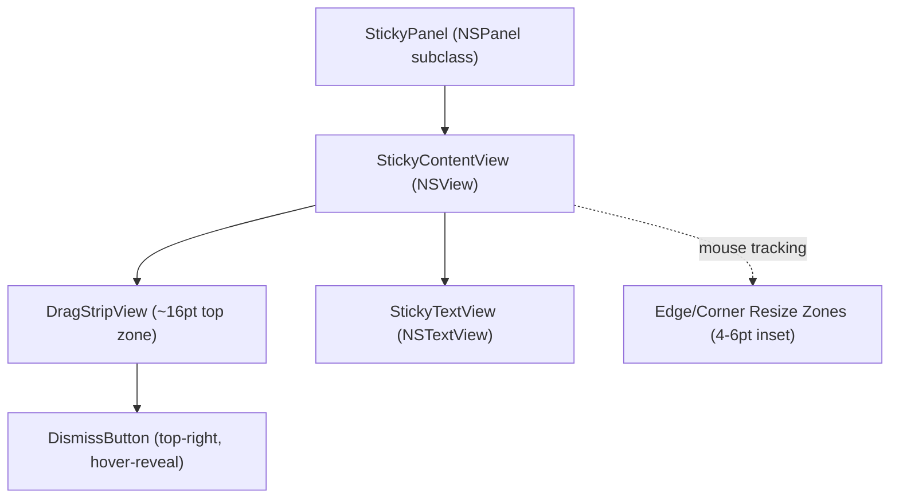
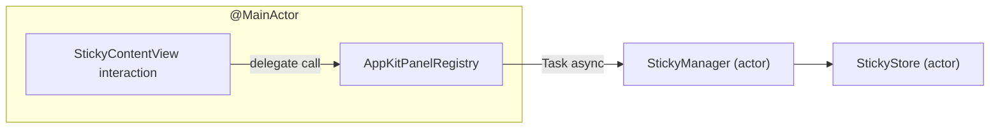

# Technical Specification: Sticky Desktop Interaction Model

**Version**: 1.0
**Date**: 2026-03-04
**Quality Score**: 90/100
**Parent Design**: [StickySpaces Design](../2026-02-26-mvp-foundation/design.md) (D-3, D-6, C-1, FR-3, FR-4, FR-6)
**PRD Reference**: [StickySpaces PRD](../2026-02-26-mvp-foundation/proposal.md) (Story 1, Story 2, Story 5)
**Spec**: [spec.md](../../../specs/sticky-desktop-interaction/spec.md)

## Overview

This spec defines how stickies behave as interactive desktop objects — the chromeless appearance, drag-to-reposition, in-place text editing, hover-reveal dismiss, edge/corner resize, and workspace binding that make a sticky feel like a note rather than a window.

The parent tech spec establishes the panel configuration contract (D-6: borderless, non-activating, floating) and workspace-binding strategy (D-3: default `collectionBehavior` keeps panels on their creator Space). The current implementation deviates from both — it uses `.titled, .closable, .resizable` style mask and `.canJoinAllSpaces` collection behavior. This spec closes that gap by specifying the full interaction model and the view hierarchy needed to replace standard window chrome with purpose-built sticky controls.

The core challenge is replacing macOS-provided affordances (title bar drag, traffic-light close, edge resize handles) with custom equivalents that work correctly on a non-activating, borderless floating panel — where standard AppKit assumptions about first-responder chains, mouse tracking, and key dispatch do not hold.

### Scope

This spec covers the sticky's on-desktop behavior only: visual appearance, reposition, resize, text editing, dismiss, GUI-to-store synchronization, and workspace binding. It does **not** cover the zoom-out canvas, CLI commands, IPC protocol, workspace topology, or other concerns already specified in the parent tech spec.

### Status Quo

Current implementation in `AppKitPanelSync.swift`:

| Aspect | Current | Target |
| --- | --- | --- |
| Style mask | `.titled, .closable, .resizable, .fullSizeContentView, .nonactivatingPanel` | `.borderless, .nonactivatingPanel` |
| Collection behavior | `.canJoinAllSpaces` (visible on all Spaces) | Default (bound to creator Space) |
| Title bar | Standard macOS title bar ("Sticky N") ~28pt | None — replaced by 16pt drag strip |
| Close button | Standard traffic-light (does not update store) | Hover-reveal X in drag strip (updates store) |
| Resize | Standard window resize handles (does not update store) | Invisible edge/corner hot zones (updates store) |
| Text editing | Stock NSTextView (GUI edits not persisted) | NSTextView with debounced store sync |
| Drag to reposition | Title bar drag (does not update store) | Drag strip drag (updates store) |

---

## Requirements

### Functional Requirements

- **FR-DI-1 (Chromeless appearance)**: A knowledge worker should see sticky text content without any window title bar, traffic-light buttons, or decorative chrome — _because orientation must be a glance with zero visual noise, and standard window chrome signals "this is an application window" rather than "this is a note."_

- **FR-DI-2 (Repositioning)**: A knowledge worker should be able to reposition a sticky by dragging its top strip, with the new position persisted — _because stickies must not obscure critical content, and the reposition affordance must coexist with text editing without ambiguity about which region does what._

- **FR-DI-3 (In-place editing with auto-persist)**: A knowledge worker should be able to edit sticky text by clicking directly in the text area, with changes automatically persisted to the store — _because intentions evolve during work, and a note that requires CLI round-trips for text updates breaks the "zero-friction capture" promise._

- **FR-DI-4 (Free resize)**: A knowledge worker should be able to resize a sticky by dragging its edges or corners, with the new size persisted — _because different workflows produce different amounts of text, and a fixed-size note either wastes screen space or hides content._

- **FR-DI-5 (Intentional dismiss)**: A knowledge worker should be able to dismiss a sticky by clicking a close button that appears only on mouse hover — _because completed tasks clutter the view, but accidental dismissal causes irreversible context loss (no undo or archive in MVP)._

- **FR-DI-6 (GUI-store coherence)**: All GUI-initiated changes (text, position, size) must be reflected in the `StickyStore` and queryable via CLI read commands (`get`, `list`, `verify-sync`) — _because the CLI/IPC API is the programmatic source of truth for automation and testing, and divergence between what the user sees and what the API reports erodes trust in both surfaces._

- **FR-DI-7 (Workspace binding)**: A sticky must be visible only on the macOS Space where it was created — _because workspace-binding is what makes a sticky an answer to "what am I doing HERE" rather than a generic note, and stickies appearing on every Space would defeat the per-workspace orientation model._

### Non-Functional Requirements

- **NFR-DI-1 (Position/size sync latency)**: Position and size changes initiated by GUI interaction should be reflected in the store within 100ms of `mouseUp` — _because `stickyspaces get` and `verify-sync` must return current state for reliable E2E testing and automation._

- **NFR-DI-2 (Text sync debounce)**: GUI text changes should be debounced and committed to the store within 500ms of the last keystroke — _because per-keystroke store writes are wasteful, but 500ms is short enough that CLI reads are never stale in practice._

### Constraints

- **C-DI-1 (Non-activating interaction)**: All sticky interactions (dragging, resizing, dismissing, text editing initiation) must not activate the StickySpaces application or steal focus from the frontmost application, except when the user clicks into the text area to type — _because the sticky is a passive orientation aid, and activating it during drag/resize/dismiss would disrupt the user's active workflow. Text editing inherently requires key window status._

- **C-DI-2 (Dismiss-only-via-hover-X)**: The hover-reveal X must be the sole GUI dismiss mechanism — no keyboard shortcut, swipe gesture, or traffic-light button — _because accidental dismissal causes irreversible context loss, and a single intentional affordance prevents "I bumped Escape and lost my note" scenarios._

- **C-DI-3 (Readability baseline)**: The sticky's visual appearance must meet parent spec NFR-6: minimum 14pt effective text size, high-contrast foreground/background, no decorative chrome — _because re-orientation fails if users must squint or parse visual noise after every context switch._

- **C-DI-4 (Minimum size)**: Stickies must enforce a minimum size of 120pt x 80pt during resize — _because smaller sizes render text unreadable and the dismiss button untouchable, making the sticky non-functional._

- **C-DI-5 (Consistency with parent spec)**: This spec's panel configuration must align with parent spec D-3 (default `collectionBehavior` for workspace binding) and D-6 (borderless, non-activating, floating) — _because the parent spec establishes the architectural contract, and this spec is an implementation detail within that contract._

---

## Architecture

### View Hierarchy



### Component Breakdown

| Component | Responsibility | Justification |
| --- | --- | --- |
| `StickyPanel` | NSPanel subclass: borderless, non-activating, floating; overrides `canBecomeKey` to return `true` for text editing | FR-DI-1, C-DI-1, C-DI-5 (implements parent D-6) |
| `StickyContentView` | Root content view: composes drag strip + text view, owns tracking area for hover-reveal and resize cursor, coordinates hit testing between interaction zones | FR-DI-2, FR-DI-4, FR-DI-5 |
| `DragStripView` | ~16pt top zone: handles `mouseDown`/`mouseDragged` for window repositioning, hosts dismiss button | FR-DI-2 |
| `DismissButton` | Small X glyph in top-right of drag strip: hidden by default, fades in on mouse hover, click fires dismiss callback | FR-DI-5, C-DI-2 |
| `StickyTextView` | NSTextView filling space below drag strip: editable, fires debounced text-change callback, flushes on focus loss | FR-DI-3, NFR-DI-2 |
| `StickyPanelDelegate` | `@MainActor` protocol for GUI-to-store callbacks: position changed, size changed, text changed, dismiss requested | FR-DI-6 |

### New/Modified Files

```
Sources/StickySpacesApp/Panels/
├── StickyPanel.swift              # NEW: NSPanel subclass (borderless config)
├── StickyContentView.swift        # NEW: root content view (composition + resize)
├── DragStripView.swift            # NEW: drag-to-reposition + dismiss host
├── DismissButton.swift            # NEW: hover-reveal X button
├── StickyTextView.swift           # NEW: NSTextView with debounced change callback
├── StickyPanelDelegate.swift      # NEW: callback protocol
└── (StickyPanel.swift from spec)  # REPLACES: inline NSPanel in AppKitPanelSync

Sources/StickySpacesApp/
├── AppKitPanelSync.swift          # MODIFIED: use StickyPanel, implement delegate
```

### Visual Design

| Element | Specification |
| --- | --- |
| Background | Pale yellow `NSColor(calibratedRed: 1.0, green: 0.98, blue: 0.75, alpha: 1.0)` with ~8pt corner radius |
| Shadow | Subtle drop shadow (`hasShadow = true` on panel) |
| Drag strip | Slightly darker yellow shade (~5% darker), 16pt tall, no text or icons (except dismiss button) |
| Dismiss button | ~14pt X glyph, 20x20pt hit target, positioned 4pt from top and right edges of drag strip, `alphaValue = 0` by default, animates to 1.0 on hover |
| Text area | Same pale yellow as background, 14pt system font, fills remaining height below drag strip |
| Resize zones | Invisible 5pt inset from all edges/corners; cursor changes to appropriate resize cursor on hover |
| Default size | 320 x 220pt (unchanged from current) |
| Minimum size | 120 x 80pt |

### Panel Configuration

```swift
class StickyPanel: NSPanel {
    // styleMask: [.borderless, .nonactivatingPanel]
    // level: .floating
    // isFloatingPanel: true
    // hidesOnDeactivate: false
    // becomesKeyOnlyIfNeeded: true
    // hasShadow: true
    // collectionBehavior: [] (default — stays on creator Space)
    // backgroundColor: .clear (content view draws rounded rect)

    override var canBecomeKey: Bool { true }
}
```

The `canBecomeKey` override is required because borderless panels return `false` by default, which would prevent text editing entirely. Combined with `becomesKeyOnlyIfNeeded = true`, the panel only becomes key when the user explicitly interacts with the text view — drag and resize never make it key.

### Callback Protocol

```swift
@MainActor
protocol StickyPanelDelegate: AnyObject {
    func stickyPanel(_ stickyID: UUID, didMoveToPosition position: CGPoint)
    func stickyPanel(_ stickyID: UUID, didResizeTo size: CGSize, position: CGPoint)
    func stickyPanel(_ stickyID: UUID, didChangeText text: String)
    func stickyPanelDidRequestDismiss(_ stickyID: UUID)
}
```

`AppKitPanelRegistry` implements this delegate. Each callback dispatches an async `Task` to `StickyManager` for store updates:



### Key Architectural Decisions

**D-DI-1: Single NSTrackingArea for hover + resize cursor.** `StickyContentView` installs one `NSTrackingArea` with `.mouseEnteredAndExited, .mouseMoved, .activeAlways` covering the full panel bounds. On `mouseMoved`, the view checks the mouse position: if within an edge/corner hot zone, it sets the appropriate resize cursor; otherwise it resets to the default arrow. On `mouseEntered`, the dismiss button fades in; on `mouseExited`, it fades out. The `.activeAlways` flag ensures tracking works even when the panel is not key — required for the hover-reveal dismiss to work on a non-activating panel. _(Satisfies FR-DI-4 cursor feedback, FR-DI-5 hover-reveal, C-DI-1 non-activating.)_

**D-DI-2: Custom resize via mouse events, not NSPanel infrastructure.** Borderless panels have no built-in resize handles. `StickyContentView` implements resize by: (1) detecting `mouseDown` within a 5pt edge/corner hot zone, (2) capturing the initial frame and mouse position, (3) tracking `mouseDragged` to compute the new frame based on which edge/corner was grabbed, (4) clamping to minimum size, (5) committing to the store on `mouseUp` via the delegate. This replaces the `.resizable` style mask behavior. _(Satisfies FR-DI-4, C-DI-4, NFR-DI-1.)_

**D-DI-3: DragStripView reposition via mouseDown/mouseDragged.** `DragStripView` captures the initial global mouse position and window origin on `mouseDown`, then adjusts `window.setFrameOrigin()` by the delta on each `mouseDragged` event. Position is committed to the store on `mouseUp`. This approach avoids `performDrag(with:)` which can trigger window-server behaviors incompatible with non-activating panels. _(Satisfies FR-DI-2, NFR-DI-1.)_

**D-DI-4: Text change debounce with flush-on-focus-loss.** `StickyTextView` observes `NSText.didChangeNotification` on itself. Each notification resets a 500ms `DispatchWorkItem` timer. When the timer fires, current text is committed via the delegate. If the text view resigns first responder (`textDidEndEditing`), any pending timer is cancelled and current text is flushed immediately. This ensures no edits are lost when the user clicks away. _(Satisfies FR-DI-3, NFR-DI-2.)_

**D-DI-5: Immediate text focus on creation.** When `AppKitPanelRegistry.show(sticky:)` creates a new panel, it calls `panel.makeKeyAndOrderFront(nil)` followed by `panel.makeFirstResponder(textView)`. This makes typing start immediately — the panel becomes key briefly for text input. When created with `--text`, the cursor is placed at the end of the pre-filled text. _(Satisfies parent spec FR-3.)_

**D-DI-6: Default collectionBehavior for workspace binding.** Removing `.canJoinAllSpaces` and using the default (empty) `collectionBehavior` makes macOS automatically bind the panel to the Space where it was created. The panel is only visible on that Space. This is the primary path per parent spec D-3. If validation fails (Phase 0 revalidation with borderless config), the fallback is `ManualVisibility` strategy — explicit `orderFront`/`orderOut` keyed by the `WorkspaceMonitor`'s current `WorkspaceID`. _(Satisfies FR-DI-7, C-DI-5.)_

### Risks & Assumptions

| Risk | Impact | Mitigation |
| --- | --- | --- |
| Borderless panel with `canBecomeKey` may behave differently across macOS versions for first-responder routing | Text editing breaks on some OS versions | Phase 1 must revalidate the Phase 0 keystroke-routing spike with the new borderless configuration before proceeding |
| `NSTrackingArea` with `.activeAlways` may not fire reliably on a non-key, non-active application's panel | Hover-reveal dismiss becomes undiscoverable; resize cursors don't appear | Phase 3 must validate tracking on a non-key panel; fallback is `.activeInActiveApp` with explicit `makeKey` on first hover |
| Custom resize via mouse events may feel less polished than native resize (no window-server live resize feedback) | Resize interaction feels laggy or imprecise | Add `disableScreenUpdatesUntilFlush` during resize for smoother rendering; accept minor polish gap vs. native for MVP |
| Default `collectionBehavior` on borderless panel may not bind to creator Space on all macOS versions | Stickies appear on wrong Spaces — core premise breaks | Phase 1 revalidates D-3 with borderless config; fallback to `ManualVisibility` per parent spec |
| Removing title bar eliminates the drag affordance users expect from windows | Users don't discover how to move stickies | Drag strip's darker shade provides visual hint; cursor changes to open-hand on hover over drag strip |

---

## Test Specification

### Testing Strategy

Tests follow the project's [testing guidelines](testing.md): name tests to communicate value, focus setup and assertions, minimize redundancy across test layers.

Two testing layers apply to this spec:

| Layer | Action Interface | Assertion Interface | What It Proves |
| --- | --- | --- | --- |
| Unit (view behavior) | Mock `StickyPanelDelegate`, programmatic view interaction | Delegate callback assertions | Interaction zones fire correct callbacks, debounce/flush works, minimum size enforced |
| E2E (round-trip coherence) | `StickySpacesClient` + synthetic mouse events or CLI | `StickySpacesClient` read queries + `verify-sync` | GUI changes reach the store and are queryable |

### Requirement Coverage Matrix

| Requirement | Primary Tests |
| --- | --- |
| FR-DI-1 (Chromeless) | `test_stickyPanel_hasBorderlessStyleMask` |
| FR-DI-2 (Reposition) | `test_dragStrip_movesPanel_persistsPosition` |
| FR-DI-3 (In-place edit) | `test_textEdit_firesDelegate_afterDebounce`, `test_textEdit_flushesOnFocusLoss` |
| FR-DI-4 (Resize) | `test_edgeResize_persistsSize`, `test_cornerResize_persistsSize` |
| FR-DI-5 (Dismiss) | `test_dismissButton_hiddenByDefault_appearsOnHover`, `test_dismissClick_firesDelegate` |
| FR-DI-6 (GUI-store coherence) | `test_guiTextEdit_reflectedInCLIGet`, `test_guiReposition_reflectedInCLIGet`, `test_guiResize_reflectedInCLIGet` |
| FR-DI-7 (Workspace binding) | `test_stickyBoundToCreatorSpace` |
| NFR-DI-1 (Sync latency) | `test_positionSync_within100ms`, `test_sizeSync_within100ms` |
| NFR-DI-2 (Text debounce) | `test_textEdit_firesDelegate_afterDebounce` |
| C-DI-1 (Non-activating) | `test_drag_doesNotActivateApp`, `test_resize_doesNotActivateApp` |
| C-DI-2 (Dismiss-only-via-X) | `test_dismissButton_isSoleGUIDismissMechanism` |
| C-DI-4 (Minimum size) | `test_resize_clampsToMinimumSize` |

### Concrete Test Sketch (Unit)

```swift
func test_dragStrip_movesPanel_persistsPosition() async {
    let delegate = MockStickyPanelDelegate()
    let panel = StickyPanel.makeForTest(stickyID: testID, delegate: delegate)
    panel.show(at: CGPoint(x: 100, y: 100), size: CGSize(width: 320, height: 220))

    let dragStrip = panel.contentView!.subviews.first { $0 is DragStripView }!
    simulateDrag(on: dragStrip, from: .zero, delta: CGPoint(x: 50, y: 30))

    XCTAssertEqual(delegate.lastPosition, CGPoint(x: 150, y: 130))
}
```

**Strategy**: `MockStickyPanelDelegate` records all callbacks. `simulateDrag` posts synthetic `mouseDown`/`mouseDragged`/`mouseUp` events to the view. Tests verify delegate callbacks, not internal panel state — so refactoring the view hierarchy doesn't break tests.

### Concrete Test Sketch (E2E)

```swift
func test_guiTextEdit_reflectedInCLIGet() async throws {
    let created = try await client.new(text: "Initial", x: 100, y: 100)

    // Simulate GUI text edit (type additional text into the sticky's text view)
    try await simulateTextInput(stickyID: created.id, appendText: " updated")

    // Wait for debounce (500ms) + store sync
    try await Task.sleep(for: .milliseconds(700))

    let sticky = try await client.get(id: created.id)
    XCTAssertEqual(sticky.text, "Initial updated")

    let sync = try await client.verifySync()
    XCTAssertTrue(sync.synced, "GUI edit not reflected in store: \(sync.mismatches)")
}
```

**Strategy**: E2E tests create stickies via the client, simulate GUI interactions, then verify via CLI reads and `verify-sync`. The 700ms sleep accounts for the 500ms debounce plus store write latency.

### Unit Test Inventory

- `test_stickyPanel_hasBorderlessStyleMask` — panel has no title bar or traffic lights (FR-DI-1)
- `test_dragStrip_movesPanel_persistsPosition` — drag on strip moves window and fires delegate (FR-DI-2, NFR-DI-1)
- `test_textEdit_firesDelegate_afterDebounce` — keystroke fires delegate after 500ms, not immediately (FR-DI-3, NFR-DI-2)
- `test_textEdit_flushesOnFocusLoss` — pending text committed immediately when text view loses focus (FR-DI-3)
- `test_dismissButton_hiddenByDefault_appearsOnHover` — alpha 0 normally, fades to 1 on mouse enter (FR-DI-5)
- `test_dismissClick_firesDelegate` — clicking X fires `stickyPanelDidRequestDismiss` (FR-DI-5)
- `test_edgeResize_persistsSize` — dragging an edge zone resizes and fires delegate (FR-DI-4)
- `test_cornerResize_persistsSize` — dragging a corner zone resizes and fires delegate (FR-DI-4)
- `test_resize_clampsToMinimumSize` — resize below 120x80 is clamped (C-DI-4)
- `test_drag_doesNotActivateApp` — frontmost app unchanged during drag (C-DI-1)
- `test_creation_focusesTextView` — new panel makes text view first responder (parent FR-3)

### E2E Test Inventory

- `test_stickyAppears_chromeless` — yabai window query confirms no title bar decoration (FR-DI-1)
- `test_guiTextEdit_reflectedInCLIGet` — type in GUI, `get` returns updated text (FR-DI-3, FR-DI-6)
- `test_guiReposition_reflectedInCLIGet` — drag sticky, `get` returns updated position (FR-DI-2, FR-DI-6)
- `test_guiResize_reflectedInCLIGet` — resize sticky, `get` returns updated size (FR-DI-4, FR-DI-6)
- `test_hoverDismiss_removesStickyFromList` — hover, click X, `list` confirms removal (FR-DI-5)
- `test_stickyBoundToCreatorSpace` — create on Space A, switch to Space B, yabai confirms no StickySpaces windows on Space B (FR-DI-7)
- `test_verifySync_passesAfterGUIEdits` — GUI text/position/size changes followed by `verify-sync` confirms coherence (FR-DI-6)

---

## Delivery Plan

### Phase 1: Chromeless Panel + Drag Strip + Workspace Binding

_Risk-first: validates the three riskiest assumptions — borderless text input, custom drag, and default collectionBehavior workspace binding._

- [ ] Create `StickyPanel` NSPanel subclass with `[.borderless, .nonactivatingPanel]`, `canBecomeKey = true`, `level = .floating`, `hasShadow = true`, default `collectionBehavior`
- [ ] Create `StickyContentView` with rounded-rect background drawing and layout for drag strip + text area
- [ ] Create `DragStripView` (~16pt, darker shade) with `mouseDown`/`mouseDragged`/`mouseUp` for window repositioning
- [ ] Create `StickyPanelDelegate` protocol
- [ ] Wire `AppKitPanelRegistry` to use `StickyPanel` instead of inline `NSPanel` construction; implement delegate to forward position changes to `StickyManager`
- [ ] Position committed to store on `mouseUp` via delegate
- [ ] Revalidate Phase 0 keystroke-routing and workspace-binding spikes with new borderless configuration
- [ ] Unit: `test_stickyPanel_hasBorderlessStyleMask`, `test_dragStrip_movesPanel_persistsPosition`, `test_drag_doesNotActivateApp`, `test_creation_focusesTextView`
- [ ] E2E: `test_stickyAppears_chromeless`, `test_guiReposition_reflectedInCLIGet`, `test_stickyBoundToCreatorSpace`
- **Acceptance (all required):**
  - [ ] Sticky appears without title bar or traffic lights
  - [ ] Dragging the top strip moves the sticky; `stickyspaces get` returns updated position
  - [ ] Sticky is visible only on its creator Space (10/10 consecutive Space-switch validations)
  - [ ] Typing starts immediately after `stickyspaces new` without activating StickySpaces
  - [ ] `verify-sync` passes after GUI reposition

### Phase 2: Bidirectional Text Editing

- [ ] Create `StickyTextView` with `NSText.didChangeNotification` observer and 500ms debounce timer
- [ ] Flush pending text on focus loss (`textDidEndEditing`)
- [ ] Immediate focus on creation: `makeKeyAndOrderFront` + `makeFirstResponder(textView)`
- [ ] Pre-filled text places cursor at end
- [ ] Wire delegate callback through `AppKitPanelRegistry` to `StickyManager`
- [ ] Unit: `test_textEdit_firesDelegate_afterDebounce`, `test_textEdit_flushesOnFocusLoss`
- [ ] E2E: `test_guiTextEdit_reflectedInCLIGet`, `test_verifySync_passesAfterGUIEdits`
- **Acceptance (all required):**
  - [ ] Typing in the GUI updates the store; `stickyspaces get` returns the new text within 700ms
  - [ ] Clicking away from the text view flushes pending text immediately
  - [ ] CLI `edit` command still works and updates the GUI text

### Phase 3: Hover-Reveal Dismiss

- [ ] Create `DismissButton` (NSButton, ~14pt X glyph, 20x20pt hit target, `alphaValue = 0` default)
- [ ] Add to `DragStripView` top-right, 4pt from edges
- [ ] Install `NSTrackingArea` (`.mouseEnteredAndExited, .activeAlways`) on `StickyContentView`
- [ ] Animate dismiss button alpha on mouse enter (fade to 1.0, ~150ms) and exit (fade to 0, ~150ms)
- [ ] Wire click to `stickyPanelDidRequestDismiss` delegate callback
- [ ] `AppKitPanelRegistry` handles dismiss: removes panel, fires async `StickyManager.dismissSticky(id:)`
- [ ] Validate `.activeAlways` tracking works on non-key panel
- [ ] Unit: `test_dismissButton_hiddenByDefault_appearsOnHover`, `test_dismissClick_firesDelegate`
- [ ] E2E: `test_hoverDismiss_removesStickyFromList`
- **Acceptance (all required):**
  - [ ] Dismiss button is invisible when mouse is outside the sticky
  - [ ] Hovering over the sticky reveals the X button
  - [ ] Clicking the X removes the sticky from `list` and the panel disappears
  - [ ] No other GUI mechanism can dismiss (no Escape, no traffic light)

### Phase 4: Edge/Corner Resize

- [ ] Implement hit-zone detection in `StickyContentView.mouseDown` (5pt inset from edges/corners)
- [ ] Set appropriate resize cursors on `mouseMoved` within tracking area: diagonal for corners, horizontal/vertical for edges
- [ ] Implement resize drag: capture initial frame + mouse position, compute new frame on `mouseDragged`, clamp to minimum 120x80
- [ ] Commit size and position to store on `mouseUp` via delegate (resize from top/left edges changes both size and origin)
- [ ] Unit: `test_edgeResize_persistsSize`, `test_cornerResize_persistsSize`, `test_resize_clampsToMinimumSize`
- [ ] E2E: `test_guiResize_reflectedInCLIGet`
- **Acceptance (all required):**
  - [ ] Dragging an edge resizes the sticky in that direction; `get` returns updated size
  - [ ] Dragging a corner resizes in two directions simultaneously
  - [ ] Resize below 120x80 is clamped; sticky never becomes smaller
  - [ ] `verify-sync` passes after GUI resize

### Risks & Dependencies

| Risk / Dependency | Impact | Mitigation |
| --- | --- | --- |
| Phase 0 spike was run with titled panel, not borderless | All phases blocked if borderless breaks text input or workspace binding | Phase 1 explicitly revalidates before proceeding to Phase 2+ |
| `.activeAlways` tracking failure on non-key panel | Phase 3 hover-reveal is undiscoverable | Fallback: use `.activeInActiveApp` and explicitly make panel key on first hover event |
| Custom resize interaction polish gap vs native | Users perceive resize as "janky" compared to other macOS windows | Accept for MVP; add `disableScreenUpdatesUntilFlush` and `NSAnimationContext` smoothing if needed |
| Existing E2E tests may depend on titled panel properties (window title, traffic-light presence) | Test breakage on Phase 1 merge | Audit existing tests for panel-chrome assumptions before starting Phase 1 |

---

## Open Questions

- [ ] Should the drag strip cursor change to an open-hand on hover (providing additional discoverability for the drag affordance), or remain as the default arrow?
- [ ] Should there be a subtle 1px separator line between the drag strip and text area, or is the color difference sufficient?

---

## Appendix: Alternatives Considered

**Modifier-key drag (Cmd+drag or Option+drag anywhere on sticky)**

- Pros: No dedicated drag strip needed — entire surface is available for text
- Cons: Undiscoverable; contradicts macOS convention where modifier-drags have different meanings; adds ~16pt of usable text area but at the cost of a hidden interaction
- **Why rejected**: The drag strip provides a clear, standard affordance with zero discovery cost, at the price of ~16pt that would otherwise be text area — an acceptable tradeoff for a 220pt-tall default panel.

**Visible corner resize handle (bottom-right grip icon)**

- Pros: Highly discoverable; familiar from classic macOS Stickies and pre-Lion windows
- Cons: Adds visible chrome to one corner; asymmetric (resize only from bottom-right)
- **Why rejected**: Invisible edge/corner hot zones with cursor feedback provide resize from all directions without visible chrome, better satisfying the "minimal visual noise" design goal. The cursor change provides sufficient discoverability.

**Escape key to dismiss focused sticky**

- Pros: Fast keyboard-driven dismissal for power users
- Cons: Easy to trigger accidentally (Escape is commonly pressed to cancel other operations); irreversible in MVP (no undo/archive)
- **Why rejected**: The risk of accidental dismissal outweighs the speed benefit. Hover-reveal X requires intentional mouse targeting, which is appropriate for an irreversible action.

**Keep `.canJoinAllSpaces` and implement manual visibility**

- Pros: Avoids relying on macOS automatic Space binding behavior, which is under-documented
- Cons: Requires manual `orderFront`/`orderOut` on every workspace switch; adds complexity and latency to the visibility path; fights the OS instead of leveraging it
- **Why rejected**: Default `collectionBehavior` is the intended macOS mechanism for Space-bound windows (parent spec D-3). Manual visibility is retained as a fallback, not a primary strategy.
